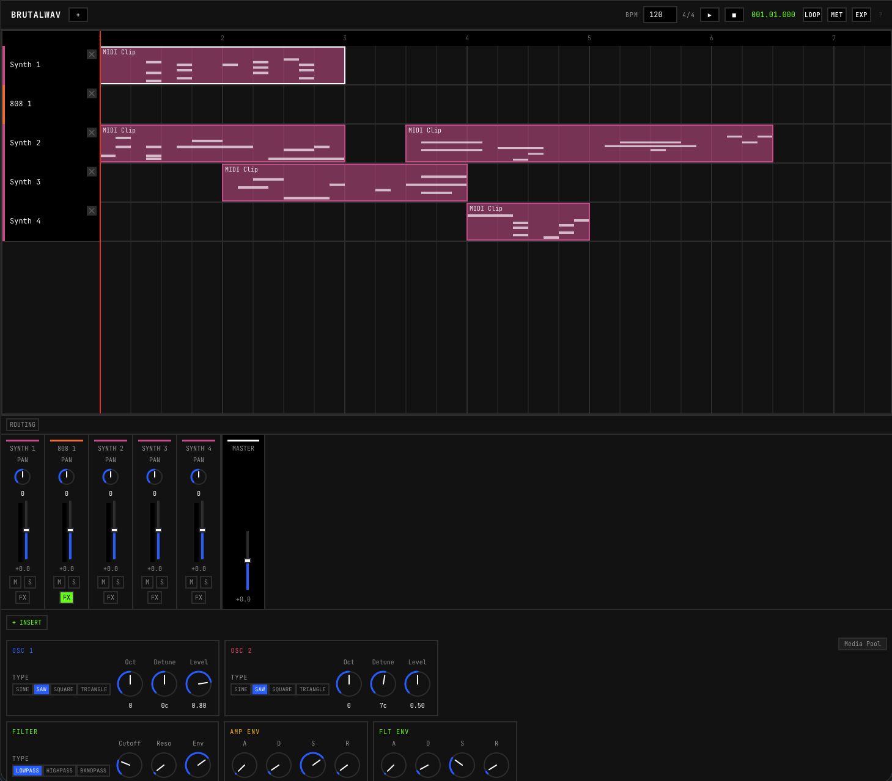
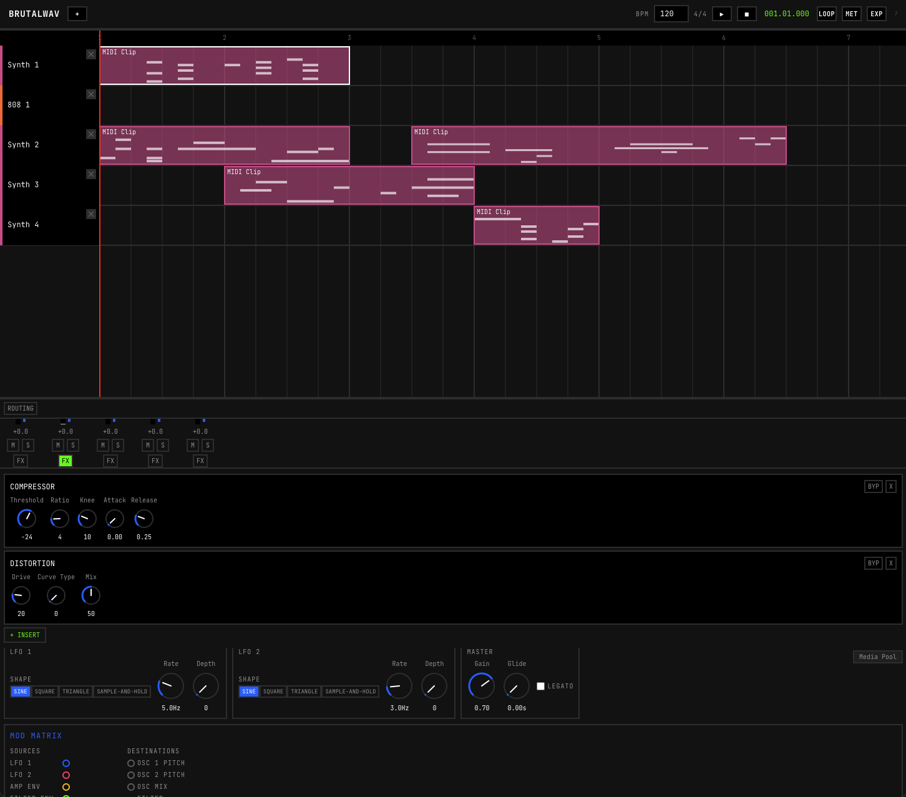
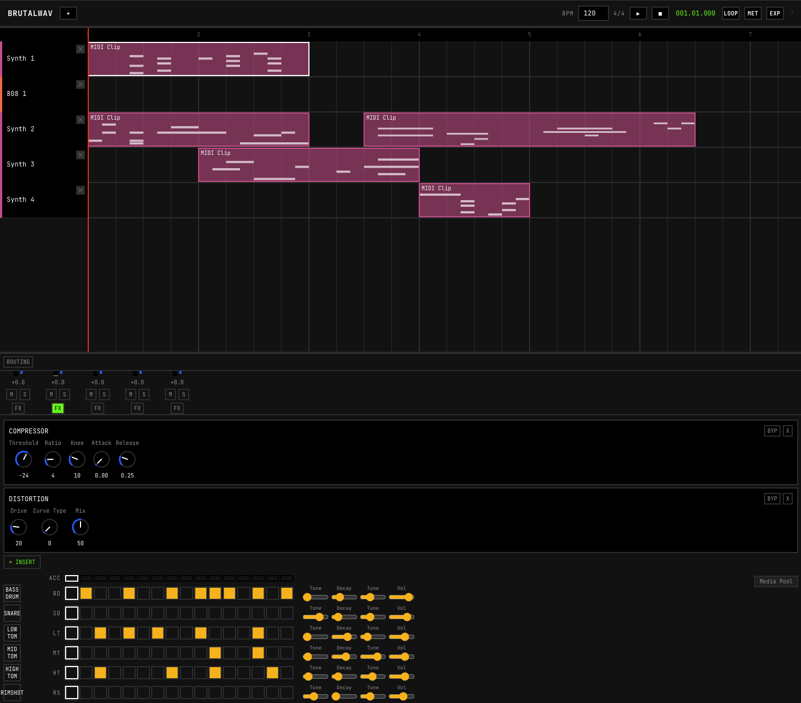

# BRUTALWAV

A browser-based Digital Audio Workstation built autonomously by AI agents. Neo-Brutalist design, Web Audio API, React + TypeScript.

**[Try the live demo](https://nathan-delacretaz.com/daw/index.html)**

<p align="center">
  
</p>

## Context

On March 24 2026, Anthropic published a [post on harness design](https://www.anthropic.com/engineering/harness-design-long-running-apps) for long-running AI coding sessions. As a demonstration, they built a browser-based DAW in 3h50m for $124.70 using an internal multi-agent harness.

This repository is the same brief, built with **[compound-agent](https://github.com/Nathandela/compound-agent)** -- an open-source Claude Code plugin that ships persistent memory, multi-agent workflows, and autonomous loop execution into any repository. The build ran autonomously for ~20 hours across multiple sessions on a Claude Max subscription, with no human intervention during the autonomous loops.

Full writeup: **[Harness Design for Dark Software Factories](https://nathan-delacretaz.com/thinks/harness-design)**

## Features

- **Synthesizer.** Subtractive polyphonic synth with oscillators, filters, ADSR envelopes, LFOs, and modulation matrix
- **Drum machine.** TR-808 style step sequencer with synthesized drum voices
- **Sequencing.** Canvas-based piano roll, arrangement view with clip dragging/trimming/splitting, grid snapping, loop regions
- **Effects.** Per-channel insert effects (reverb, delay, chorus, distortion, EQ, compressor)
- **Mixer.** Multi-track mixer with volume, pan, mute, solo, and master bus
- **Automation.** Breakpoint automation lanes with multiple curve types
- **Audio.** AudioWorklet-based DSP, SharedArrayBuffer transport, look-ahead scheduling, offline WAV bounce

<p align="center">
  
  
</p>

## Running locally

```bash
pnpm install
pnpm dev
```

Open `http://localhost:5173`. Requires a modern browser with Web Audio API and SharedArrayBuffer support.

## How it was built

The entire application was produced by [compound-agent](https://github.com/Nathandela/compound-agent)'s autonomous loop (`ca loop`). The process:

1. **Architect phase** -- Socratic dialogue to decompose the brief into 18 dependency-ordered tasks
2. **Per-task cycle** -- Each task runs through spec, plan, TDD implementation, and multi-model review (Claude Sonnet, Claude Opus, Gemini, Codex in parallel)
3. **Polish loop** -- 5 additional review-and-fix cycles across the full codebase
4. **Persistent memory** -- Mistakes captured as lessons, surfaced automatically in future tasks

The `agent_logs/` directory contains the full trace: review reports, architect prompts, implementer logs, and loop execution records.

## Stack

- React 19 + TypeScript (strict mode)
- Vite
- Zustand (state management)
- Canvas 2D (arrangement, piano roll, knobs)
- Web Audio API + AudioWorklet
- Vitest + Testing Library

## Scripts

| Command | Description |
|---------|-------------|
| `pnpm dev` | Start dev server |
| `pnpm build` | Type-check + production build |
| `pnpm test` | Run test suite |
| `pnpm check` | Lint + format check + tests |

## See also

- **[compound-agent](https://github.com/Nathandela/compound-agent)** -- The harness that built this. Persistent memory, multi-agent review, autonomous loops.
- **[Harness Design for Dark Software Factories](https://nathan-delacretaz.com/thinks/harness-design)** -- Blog post comparing this approach to Anthropic's internal harness.
- **[Anthropic: Harness Design for Long-Running Apps](https://www.anthropic.com/engineering/harness-design-long-running-apps)** -- The post that inspired this benchmark.
- **[Live demo](https://nathan-delacretaz.com/daw/index.html)** -- Try BRUTALWAV in the browser.

## License

MIT
