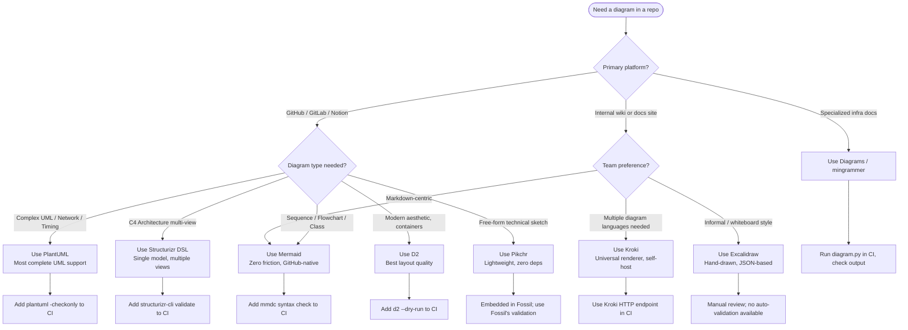
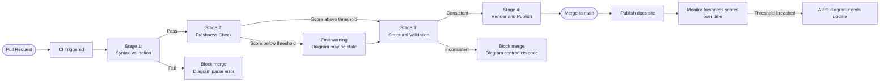
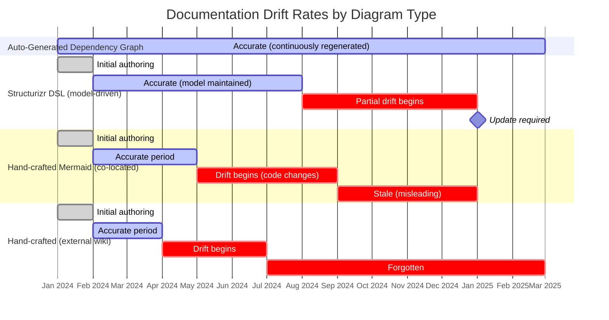

# When the Map Lives With the Territory: Accuracy Dynamics and Documentation Drift of Co-Located Diagrams-as-Code

**A PhD-Depth Survey**

---

## Abstract

Technical diagrams embedded as text within version-controlled repositories occupy an epistemologically novel position: unlike external design artifacts, they reside in the same ontological space as the system they depict. This survey examines the accuracy dynamics, maintenance patterns, and tooling ecosystem of co-located diagrams-as-code. Drawing on empirical software engineering research, practitioner surveys, and tool analyses, we demonstrate that co-location is a necessary but insufficient condition for diagram freshness. The "stale diagram paradox" -- wherein outdated diagrams actively mislead developers more than absent diagrams -- motivates a Diagram Freshness Framework integrating temporal staleness heuristics, CI/CD structural validation, and principled heuristics for choosing between auto-generation and hand-crafting. We survey twelve diagrams-as-code tools, map the theoretical landscape from Korzybski's map-territory epistemology through Martraire's Living Documentation paradigm, and propose open research problems including semantic diagram diffing, freshness scoring, and hybrid generation pipelines.

---

## 1. Introduction

Alfred Korzybski's foundational observation -- "a map is not the territory it represents, but, if correct, it has a similar structure to the territory, which accounts for its usefulness" -- identifies the central tension in software architecture documentation. A diagram of a system is a lossy compression: it omits details, enforces a viewpoint, and freezes a moment in time. What Korzybski could not have anticipated is the modern scenario in which the map and the territory are stored in adjacent files within the same Git repository, subject to the same commit history, reviewed in the same pull requests, and deployed through the same CI/CD pipeline.

This co-location changes the epistemological dynamics fundamentally. The diagram is no longer an external observer's model -- it is an internal artifact with a known provenance, a diff history, and a last-modified timestamp that can be compared against the last-modified timestamps of the code it purports to describe. The question is no longer merely "is this diagram accurate?" but "by how much has this diagram drifted from its target since the last shared commit, and does anyone in the repository's community of practice know this?"

This survey addresses that question across seven dimensions:
1. The empirical literature on documentation drift and decay
2. The landscape of diagrams-as-code tools
3. The co-location hypothesis and proximity principle
4. CI/CD-based diagram validation approaches
5. Developer trust and comprehension of diagrams
6. Auto-generation versus hand-crafting trade-offs
7. Version control semantics for visual artifacts

### 1.1 Scope and Methodology

This survey synthesizes peer-reviewed empirical studies (primarily from ICSE, FSE, MSR, and TOSEM), practitioner reports (IcePanel State of Software Architecture 2024/2025, Stack Overflow Developer Surveys), and tool documentation. The covered period is 2010-2025, with emphasis on 2019-2025 for empirical findings. Where formal studies are absent, we document practitioner consensus and identify gaps as open research problems.

---

## 2. Foundations

### 2.1 Korzybski's Epistemology Applied to Software Diagrams

Alfred Korzybski (1933) coined "the map is not the territory" in his work on General Semantics to argue that human knowledge is always mediated by abstractions, and that confusing the abstraction for reality produces systematic errors. He called the cultivated awareness of this gap "consciousness of abstracting."

In software engineering, every diagram is an abstraction from the running system. Three classical properties of Korzybski's maps apply directly:

- **Incompleteness**: A map cannot represent everything about the territory. A sequence diagram cannot encode runtime performance characteristics; a component diagram cannot capture dynamic dependency injection.
- **Selectivity**: A map is drawn from a particular viewpoint for a particular purpose. A C4 Context diagram (Brown, 2011) shows system boundaries; a C4 Component diagram shows internal structure. Neither is "the whole truth."
- **Potential for confusion**: When practitioners treat the diagram as the ground truth rather than the code -- "let me check the architecture diagram to understand what service calls what" -- Korzybski's confusion of map and territory becomes a production risk.

**The Co-Location Shift.** When a diagram lives in the same repository as the code, several of these dynamics change:

1. *Ontological proximity*: The map and territory share version history. A `git log` on the diagram file can be compared against a `git log` on the code files it depicts.
2. *Review coupling*: Pull requests that change code can include corresponding diagram updates, making the map a first-class artifact of the change process.
3. *Freshness observability*: The gap between `diagram_last_modified` and `code_last_modified` is computable, enabling automated freshness scoring.
4. *Social contract*: The presence of the diagram in the repository creates an implicit expectation among contributors that it will be maintained, which can have either positive (motivation to update) or negative (false confidence) consequences.

The transition from "external model" to "internal specification" is not merely organizational; it changes the diagram's epistemic status. An external diagram is a snapshot frozen at a moment of authoring. An internal diagram carries the expectation of currency.

### 2.2 The Living Documentation Paradigm

Cyrille Martraire's *Living Documentation: Continuous Knowledge Sharing by Design* (Addison-Wesley, 2019) systematizes the insight that documentation must evolve at the same rate as the system it describes. Martraire articulates several principles directly relevant to this survey:

- **Single Source of Truth**: Documentation should be derived from authoritative sources (code, tests, infrastructure definitions) rather than maintained separately.
- **Accuracy by Construction**: Automated generation from code eliminates the synchronization problem for certain classes of documentation.
- **Curated Abstraction**: Not all documentation can or should be generated. Domain knowledge, architectural rationale, and system-level viewpoints require human curation.
- **Proximity**: Documentation artifacts that live near the code they describe are more likely to be updated when the code changes.

The Living Documentation paradigm directly informs the co-location hypothesis examined in Section 4.

### 2.3 Specification by Example and BDD

Gojko Adzic's *Specification by Example* (Manning, 2011) establishes the precedent that executable specifications (BDD scenarios, Cucumber features) can serve as living documentation when they are co-located with code and enforced by CI. This is a strong form of co-location: the documentation is not merely nearby but is executed against the system, providing automated staleness detection. Diagrams-as-code aspire to a weaker version of this -- co-location without execution -- which is why structural validation in CI (Section 6) is such an important research frontier.

---

## 3. Documentation Drift: Empirical Evidence

### 3.1 Aghajani et al. (2019): Software Documentation Issues Unveiled

The most comprehensive empirical study of documentation quality to date is Aghajani, Nagy, Vega-Márquez, Linares-Vásquez, Moreno, Bavota, and Lanza (2019), "Software Documentation Issues Unveiled," presented at ICSE 2019. The authors mined 878 documentation-related artifacts from mailing lists, Stack Overflow discussions, issue repositories, and pull requests across multiple open-source projects.

Key findings relevant to diagram accuracy:
- The six most critical quality attributes are **accuracy, clarity, consistency, readability, structuredness, and understandability**
- **Incompleteness** and **incorrectness** were the most frequently cited problems in practitioner discourse
- Despite documentation's recognized importance, creation and maintenance are routinely neglected
- The study demonstrates that mining practitioner discourse is an effective method for understanding real-world documentation failure modes -- a methodology applicable to studying diagram-specific issues

Aghajani et al. (2020) conducted a follow-up survey study ("Software Documentation: The Practitioners' Perspective") confirming that developers most frequently describe documentation as "incomplete" or "outdated."

### 3.2 Uddin and Robillard (2015): How API Documentation Fails

Uddin and Robillard's study of 323 IBM software professionals (IEEE Software, 2015) catalogued ten types of documentation failure through a card-sorting methodology. The three most severe were:

1. **Ambiguity of content** -- content that can be interpreted multiple ways
2. **Incompleteness** -- missing coverage of features, parameters, or edge cases
3. **Incorrectness** -- content that contradicts actual system behavior

Of particular relevance: respondents identified six of the ten problem types as "blockers" that forced them to abandon the documented API. This finding has direct implications for architecture diagrams: an incorrect sequence diagram describing a microservice call chain does not merely cause confusion -- it can cause developers to implement integrations based on false assumptions.

### 3.3 IcePanel State of Software Architecture (2024 and 2025)

IcePanel's surveys (2024: 96 respondents; 2025: similar scale) provide the most recent practitioner-scale data on diagram maintenance behavior:

- **Keeping documentation up to date** was identified as the overwhelming top challenge, outranking lack of standards and difficulty finding the right level of detail
- Documentation update frequency: monthly (28%), quarterly (23%), weekly (23%) -- meaning approximately half of teams update documentation monthly or less
- 60% of respondents predicted AI-assisted documentation generation would have the largest impact in the next 5 years
- 96% used diagramming tools; 79% used collaborative wikis
- Only 3% of engineers (per Backstage TechDocs / Port research) fully trust their documentation repositories

### 3.4 The Stale Diagram Paradox

Practitioner discourse consistently articulates what we term the **Stale Diagram Paradox**: outdated diagrams are worse than no diagrams. The mechanism is:

1. Developer encounters a diagram and, absent contrary signals, assumes it is accurate
2. Developer forms a mental model based on the diagram's depicted structure
3. The mental model is wrong because the diagram is stale
4. Developer implements code based on the wrong model
5. Bugs are introduced that would not have been introduced by reading code directly

This dynamic is empirically supported by the broader documentation quality literature. Uddin and Robillard's finding that incorrect documentation is a "blocker" (worse than no documentation from a decision-making standpoint) applies with equal force to visual documentation.

The paradox has a compounding property: developers who encounter stale diagrams stop trusting documentation systems, which reduces update contributions, which increases staleness, which erodes trust further. This is a classic tragedy-of-the-commons dynamic in shared documentation systems.

### 3.5 Architecture Drift: The Code Side of the Problem

The academic literature on **architectural drift** provides the code-side complement to documentation staleness. Architectural drift is formally defined as the divergence between the prescribed architecture (typically expressed as design documents or diagrams) and the implemented architecture (the actual code structure).

Key findings from architectural drift research:
- Drift is detected through reflexion model analysis (comparing abstract code models against architectural specifications)
- Drift accumulates continuously as code evolves; without active conformance checking, drift tends to increase monotonically
- Automated drift detection tools (ArchSync, Architecture Conformance Analysis) can identify structural violations but require machine-readable architectural specifications

This connects directly to the CI/CD validation problem: if an architecture diagram is expressed in a machine-readable DSL (Structurizr, PlantUML with strict modes), it becomes possible to compare the diagram against dependency analysis outputs, enabling automated drift detection.

---

## 4. The Diagrams-as-Code Ecosystem: Comprehensive Taxonomy

### 4.1 Classification Framework

We classify diagrams-as-code tools along five dimensions:

| Dimension | Values |
|-----------|--------|
| **Paradigm** | Declarative / Imperative / Hybrid |
| **Scope** | UML-focused / Architecture-focused / General-purpose |
| **Runtime** | Browser-native / JVM / Native binary / Python |
| **VCS Integration** | Native (text diff) / XML (limited diff) / Binary (no diff) |
| **Layout** | Automatic / Manual / Hybrid |

### 4.2 Tool Profiles

**Graphviz/DOT (1991)**
The oldest actively maintained diagrams-as-code tool, written in C, invented at AT&T Bell Labs by John Ellson, Emden Gansner, and Eleftherios Koutsofios. DOT is a declarative graph description language with multiple layout engines (dot for hierarchical, neato for spring model, fdp for force-directed, circo for radial, twopi for radial). Graphviz underpins numerous other tools (Doxygen, pydeps, PlantUML internals). Its primary limitation is that the DOT language is graph-theoretic rather than diagrammatic: it has no native concept of sequence diagrams, state machines, or architectural layering.

**PlantUML (2009)**
A JVM-based tool (Java) that compiles a custom text DSL into UML-standard diagrams via Graphviz and its own rendering engine. PlantUML is the most comprehensive UML tool in the diagrams-as-code space, supporting: sequence, use case, class, activity, component, deployment, state, object, entity-relationship, timing, network (nwdiag), wireframe (salt), MindMap, JSON visualization, YAML visualization, and Gantt charts. Its limitations include Java dependency, server-side rendering requirements for some deployments, and verbose syntax for complex diagrams.

**Mermaid (2014)**
A JavaScript-based diagramming tool that renders within browsers and is natively supported by GitHub (since 2022), GitLab, Notion, Confluence, and Azure DevOps. Mermaid's key differentiator is zero-friction rendering in Markdown contexts: a fenced code block with `mermaid` as the language tag renders automatically on supported platforms. It supports: flowchart, sequence, class, state, entity-relationship, Gantt, pie chart, gitGraph, user journey, C4, timeline, mindmap, quadrant, XYChart, and architecture-beta diagrams. Its expressiveness is more limited than PlantUML for complex UML, but its frictionlessness makes it the dominant choice for inline documentation.

**Structurizr DSL (2019)**
Created by Simon Brown, the inventor of the C4 model, Structurizr DSL is unique in being **model-first** rather than **view-first**. Authors define a workspace containing elements (people, software systems, containers, components) and relationships, then define multiple views (context, container, component, deployment, dynamic) over that model. This single-model-multiple-views approach eliminates the inconsistency problem common in view-per-file tools: if a component is renamed in the model, all views reflecting that component update automatically. Structurizr DSL can export to PlantUML, Mermaid, and WebSequenceDiagrams. This makes it the strongest candidate for architecturally coherent, drift-resistant documentation.

**D2 (2022, Terrastruct)**
A Go-based modern diagram scripting language that addresses aesthetic limitations of earlier tools. D2's primary differentiator is its support for multiple layout engines: dagre (default, based on Graphviz's dot algorithm), ELK (bundled), and TALA (commercial, designed specifically for software architecture). D2's syntax is more expressive than Mermaid for complex architectural diagrams and produces significantly better aesthetics than raw Graphviz. D2 supports containers/groups, markdown in labels, code blocks in nodes, SQL table definitions, and has a live preview mode. It exports SVG, PNG, PDF, and PowerPoint.

**Pikchr (2020, SQLite/Fossil project)**
Created by D. Richard Hipp (the creator of SQLite and Fossil SCM), Pikchr is a modern reinterpretation of the PIC diagram language from the 1970s Unix toolchain. Delivered as a single C source file with zero dependencies, Pikchr is designed for embedding in technical documentation at the lightest possible footprint. It is used to generate all graphical syntax diagrams in the SQLite documentation (replacing the previous GIF-based pipeline). Pikchr is intentionally general-purpose -- it can draw arbitrary shapes -- rather than domain-specific like UML tools. This gives it maximum expressiveness at the cost of requiring more explicit positioning specification.

**Kroki (2020)**
Not a diagramming language but a **universal rendering service**: a self-hostable HTTP API that accepts diagram source code in any of 20+ supported formats (BlockDiag, BPMN, D2, DBML, Excalidraw, Graphviz, Mermaid, Nomnoml, Pikchr, PlantUML, SvgBob, UMLet, Vega, WaveDrom, and more) and returns rendered SVG, PNG, or JPEG. Kroki's significance for the co-location hypothesis is that it decouples the rendering infrastructure from the diagram language choice: organizations can use any diagram syntax in their documentation and render it uniformly. GitLab has native Kroki integration. Kroki is open-source and written in a polyglot architecture (Haskell, Python, JavaScript, Go, PHP, Java backends unified by a Vert.x gateway).

**Diagrams (2020, Mingrammer)**
A Python library for generating cloud architecture diagrams programmatically. Diagrams uses Python as its DSL and Graphviz as its rendering backend. It supports major cloud providers (AWS, Azure, GCP, Alibaba, Oracle, IBM), Kubernetes, and on-premises architectures. Its key differentiator is that diagram definitions are Python code: they can be parameterized, looped over, conditionally generated, and integrated with Python-based infrastructure tooling. Apache Airflow uses Diagrams in its official documentation pipeline.

**Excalidraw (2020)**
An outlier in the diagrams-as-code space: a collaborative whiteboard tool producing hand-drawn aesthetic diagrams. Excalidraw's native format is JSON (.excalidraw), which is text-based and diffable, though the diff signal is lower-fidelity than purpose-built text DSLs. Its VS Code extension, GitHub rendering support (via .excalidraw.svg files that embed scene data in PNG/SVG headers), and zero-learning-curve aesthetic have made it popular for informal architecture sketches, especially in the "thinking" phase before formalization. Excalidraw is adopted by Google Cloud, Meta, CodeSandbox, and HackerRank.

### 4.3 Feature Comparison Matrix

| Tool | Language | GitHub Native | Layout | Export | UML Support | C4 Support | Diff Quality | CI Validation |
|------|----------|--------------|--------|--------|-------------|------------|--------------|---------------|
| Graphviz/DOT | C | No | Auto (multi-engine) | SVG/PNG/PDF | Partial | No | High | Yes (CLI) |
| PlantUML | Java/JVM | Via plugin | Auto | SVG/PNG/PDF/LaTeX | Full | Via C4-PlantUML | High | Yes (CLI) |
| Mermaid | JavaScript | Native (2022) | Auto | SVG/PNG | Partial | Yes (C4-beta) | High | Yes (mmdc) |
| Structurizr DSL | JVM | No | Auto | SVG/PNG (exports to Mermaid/PlantUML) | Partial (C4-native) | Native | High | Yes (CLI) |
| D2 | Go | No | Auto (multi-engine) | SVG/PNG/PDF/PPTX | No | No | High | Yes (CLI) |
| Pikchr | C | No | Manual | SVG (embedded HTML) | No | No | High | Via Fossil |
| Kroki | Multi | Via GitLab | Delegated | SVG/PNG/JPEG | Delegated | Delegated | High | Yes (HTTP) |
| Diagrams | Python | No | Auto (Graphviz) | PNG | No | No | High | Yes (Python) |
| Excalidraw | JavaScript | Via .svg | Manual | SVG/PNG/.excalidraw | No | No | Medium | Limited |

### 4.4 Diagram Type Coverage Matrix

| Diagram Type | Graphviz | PlantUML | Mermaid | Structurizr | D2 | Pikchr |
|---|---|---|---|---|---|---|
| Sequence | No | Yes | Yes | Yes | No | No |
| Class/UML | Partial | Yes | Yes | No | Yes | No |
| Entity-Relationship | No | Yes | Yes | No | Yes (SQL tables) | No |
| State Machine | No | Yes | Yes | No | No | No |
| Component | Partial | Yes | Limited | Yes (C4) | Yes | No |
| Deployment | Partial | Yes | Limited | Yes (C4) | Yes | No |
| Activity/Flow | Yes | Yes | Yes (flowchart) | No | Yes | Yes |
| Gantt | No | Yes | Yes | No | No | No |
| GitGraph | No | No | Yes | No | No | No |
| Network/Infra | No | Yes (nwdiag) | No | No | No | No |
| Free-form | Yes | Limited | No | No | Yes | Yes |
| Mindmap | No | Yes | Yes | No | No | No |

---

## 5. The Co-Location Hypothesis

### 5.1 Proximity Principle: Theory and Evidence

The core hypothesis this survey examines -- that keeping diagrams in the same VCS as code reduces documentation drift -- rests on several theoretical mechanisms and a limited but consistent body of empirical evidence.

**Theoretical mechanisms:**

1. *Commit coupling*: When code changes require diagram updates to pass code review, the maintenance friction is reduced by the co-location making the update immediately accessible
2. *Social visibility*: Diagrams in the main repository are visible to all contributors, increasing the probability that someone will notice and correct staleness
3. *Automated observability*: Git timestamps enable freshness computation (see Section 7)
4. *Shared ownership*: Documentation in the repository is "owned" by the development team rather than a separate documentation team, which eliminates the handoff failure mode

**Empirical evidence:**
- The docs-as-code movement (Write the Docs community) documents practitioner consensus that documentation in version control is more likely to be updated alongside code changes
- ADR adoption studies show that placing Architecture Decision Records in the repository increases their longevity and discoverability compared to wiki-based approaches
- Swimm's code-coupled documentation approach (automatic staleness detection when linked code changes) demonstrates the strongest version of the proximity principle: the tool alerts maintainers when code changes affect documentation snippets

**Limitations of the evidence:**
Formal controlled studies comparing diagram accuracy rates between co-located and externally-stored diagrams do not yet exist. The evidence is primarily observational and practitioner-reported. This is the most significant empirical gap in this survey area.

### 5.2 README-Driven Development

Tom Preston-Werner (GitHub co-founder) articulated the proximity principle for project documentation in "Readme Driven Development" (2010): writing the README first -- before code, tests, or specifications -- forces clarity of intent and places the primary documentation artifact at the highest-proximity location (the repository root). This establishes the convention that the README is the canonical entry point and is expected to be current.

The README-as-living-documentation approach has been generalized to:
- `CONTRIBUTING.md` for contribution workflows
- `ARCHITECTURE.md` for high-level system structure
- `docs/adr/` directories for Architecture Decision Records
- `docs/` directories containing diagram source files

### 5.3 Architecture Decision Records: A Success Case

ADRs (Architecture Decision Records), first systematized by Michael Nygard (2011) and widely adopted in the 2019-2024 period (Microsoft Azure Well-Architected Framework, AWS Prescriptive Guidance), demonstrate that co-located decision documentation can be maintained over long periods when:

- The format is lightweight (Markdown, 1-2 pages)
- There is a clear lifecycle (Proposed, Accepted, Superseded, Deprecated)
- The review process is integrated with normal PR workflows
- The decision record explicitly links to the code context it affects

ADR success factors from the ozimmer.ch adoption model (Zimmermann, 2023):
- **Usage scenario**: ADRs created iteratively as part of design work, not retroactively
- **Scope**: Sharing culture across teams increases longevity
- **Structure and location**: Minimal template, repository-resident, searchable
- **Process**: Defined significance criteria preventing over-documentation

The ADR success case provides a blueprint for diagram-as-code maintenance: co-location is necessary but must be combined with lifecycle management, format simplicity, and process integration.

### 5.4 The Docs-as-Code Movement

The "docs-as-code" paradigm (Anne Gentle's foundational framing) establishes that documentation should be:
- Written in plain text (Markdown, reStructuredText, AsciiDoc)
- Version-controlled (Git)
- Reviewed via pull requests
- Tested via CI (link checking, spell checking, style enforcement)
- Deployed via CD pipelines

This paradigm subsumes diagrams-as-code as a natural extension: the diagram source file is a documentation artifact that participates in all the same workflows as prose documentation.

---

## 6. CI/CD Validation of Diagrams

### 6.1 Levels of Diagram Validation

We propose a three-level hierarchy of diagram validation, analogous to the testing pyramid:

**Level 1: Syntax Validation**
Verify that the diagram source parses correctly without rendering errors.
- Mermaid: `mmdc -i diagram.mmd -o /dev/null` (mermaid-cli)
- PlantUML: `java -jar plantuml.jar -checkonly diagram.puml`
- D2: `d2 diagram.d2 /dev/null`
- Structurizr: `structurizr-cli validate -workspace workspace.dsl`

Level 1 validation catches broken diagrams before they are merged. It is the easiest CI integration and should be the minimum standard for any repository containing diagrams-as-code.

**Level 2: Structural Consistency Validation**
Verify that elements referenced in the diagram exist in the actual codebase. This requires tool-specific approaches:
- For dependency diagrams: compare diagram edges against dependency-cruiser (JavaScript/TypeScript) or pydeps (Python) output
- For component diagrams: compare diagram nodes against package/module inventory
- For sequence diagrams: compare actors against service inventories in service mesh configurations

Level 2 validation requires custom integration work but provides the strongest guarantee against architectural drift.

**Level 3: Semantic Accuracy Validation**
Verify that the diagram's depicted behavior matches the system's actual behavior. This is the hardest level and typically requires runtime analysis:
- Dynamic call graph comparison against sequence diagram edges
- Distributed tracing data compared against interaction diagrams
- Infrastructure state (Terraform state, Kubernetes manifests) compared against deployment diagrams

Level 3 is currently the frontier of research and tooling. The Pulumi blog's "automatic diagram generation for always-accurate diagrams" (2024) demonstrates the Level 3 ideal achieved through auto-generation: if the diagram is generated from the IaC definition, and the IaC definition is the ground truth, the diagram is accurate by construction.

### 6.2 Auto-Generation Tools for Level 2/3 Validation

**dependency-cruiser**: Validates and visualizes dependencies in JavaScript, TypeScript, and CoffeeScript. Supports rule definition (forbidden dependencies, required dependencies) enforced in CI. Can output DOT/Graphviz for visualization. The primary tool for Level 2 structural validation in JavaScript ecosystems.

**pydeps**: Generates dependency graphs from Python bytecode analysis. Outputs Graphviz DOT format. Useful for comparing against hand-crafted architectural diagrams of Python systems.

**madge**: Similar to dependency-cruiser but simpler; better for visualization than enforcement.

**Doxygen**: Generates class hierarchy and collaboration diagrams from C/C++/Java/Python source comments. The original auto-generation approach; produces accurate but often overwhelming diagrams.

**TypeDoc**: Generates API documentation from TypeScript type annotations; can emit structural information for diagram generation.

**swark** (2024): A novel tool that uses LLMs to generate Mermaid architecture diagrams from codebase analysis, combining auto-generation accuracy with better abstraction than raw dependency graphs.

### 6.3 CI Pipeline Integration Pattern

The following represents the recommended CI integration for diagram validation:

```
Trigger: PR opened / push to main
├── Stage 1: Syntax Validation (all diagram files)
│   ├── mmdc --input *.mmd --output /dev/null
│   ├── plantuml -checkonly *.puml
│   └── d2 --dry-run *.d2
├── Stage 2: Freshness Check (optional, informational)
│   ├── For each diagram file: compare git log dates
│   │   against git log dates of referenced source paths
│   └── Emit warning if freshness score < threshold
├── Stage 3: Structural Consistency (where tooling exists)
│   ├── Run dependency-cruiser (JS projects)
│   ├── Run pydeps (Python projects)
│   └── Compare output against diagram assertions
└── Stage 4: Render and Publish (on merge to main)
    ├── Render all diagrams to SVG/PNG
    └── Publish to documentation site
```

### 6.4 The Diagram Testing Gap

A significant gap exists between the theoretical ideal of Level 2/3 validation and the practical state of tooling. No mainstream tool currently provides:
- A declarative assertion language for diagram content ("this diagram must contain a component named X")
- Automated comparison between a hand-crafted diagram and an auto-generated equivalent
- Semantic diff of diagram changes (showing what architectural relationships were added/removed rather than what DSL syntax changed)

This gap defines the most pressing open research problem in this domain.

---

## 7. Developer Trust and Comprehension

### 7.1 Petre (2013): UML in Practice

Marian Petre's "UML in Practice" (ICSE 2013) is the definitive empirical study of how professional software developers actually use UML. Over two years of interviews with more than 50 professional software engineers across 50 companies and multiple continents, Petre found:

- UML is by no means universally adopted despite being the "de facto standard"
- Practitioners take a broad view of "modeling" that extends well beyond formal UML notation
- Use tends to polarize between early design (sketching) and implementation documentation, rarely both
- Many practitioners use informal, partial, or non-UML diagram notations that communicate their intent more effectively than formal notation

The follow-up paper ("No shit" or "Oh, shit!" -- Software and Systems Modeling, 2014) documented the polarized reaction to these findings: experienced practitioners found the results unsurprising ("no shit"), while methodology advocates were alarmed ("oh, shit!").

**Implications for diagrams-as-code**: Petre's findings suggest that the choice of notation matters less than the integration into workflow. Developers who already use informal sketching may resist formal DSL-based diagramming; the frictionlessness of Mermaid (which can be embedded in any Markdown file on GitHub with zero tooling setup) is specifically designed to address this resistance.

### 7.2 UML Comprehension Research

UML class diagram comprehension has been studied extensively (Cognitive Dimensions framework, empirical experiments with eye-tracking). Key findings:

- Comprehension quality correlates with diagram layout quality -- poor automatic layouts reduce comprehension even when content is accurate
- Developer expertise mediates comprehension: junior developers benefit more from diagrams, but are also more vulnerable to being misled by inaccurate ones
- There is a tension between diagram completeness (showing all elements) and comprehension (too many elements reduce understanding)

This tension directly motivates the auto-generation vs. hand-crafting debate: auto-generated diagrams tend toward completeness; hand-crafted diagrams tend toward curated comprehensibility.

### 7.3 Empirical Data on Developer Trust

From practitioner sources:
- Only 3% of engineers fully trust their documentation repositories (State of IDP report, cited by Port)
- Documentation is the most common reason for onboarding failure: new engineers following stale documentation have caused production incidents (documented practitioner cases)
- Good documentation reduces onboarding time and increases 90-day retention by up to 82% (Multiplayer.app research)
- Technical documentation occupies approximately 11% of developer working hours

The 3% trust figure, if robust, is damning: it means that developers who encounter documentation (including diagrams) approach it with an a priori assumption of potential inaccuracy. This undermines one of the primary stated benefits of documentation -- reducing cognitive load by providing trustworthy pre-synthesized knowledge.

---

## 8. Auto-Generation vs. Hand-Crafting: A Framework

### 8.1 The Fundamental Tension

Auto-generated diagrams and hand-crafted diagrams occupy opposite ends of a two-dimensional trade-off space:

| Dimension | Auto-Generated | Hand-Crafted |
|-----------|----------------|--------------|
| Accuracy | High (by construction) | Degrades over time |
| Abstraction | Low (tends toward exhaustive) | High (curated) |
| Aesthetics | Variable (layout engine dependent) | High (intentional) |
| Maintenance cost | Near-zero | Continuous |
| Onboarding value | Low (overwhelming detail) | High (curated entry point) |
| Architectural rationale | None | Can embed intent |
| Drift risk | None | High |

### 8.2 Hybrid Approaches

The practitioner consensus (Pulumi blog, InfoQ "Crafting Architectural Diagrams," Terrastruct documentation) converges on a hybrid strategy:

1. **Auto-generated dependency diagrams** for structural validation (Level 2 CI) and for exploratory understanding by developers who need the full picture
2. **Hand-crafted high-level diagrams** for onboarding, stakeholder communication, and architectural rationale
3. **Model-driven diagrams** (Structurizr) as the middle path: a human-maintained model generates multiple views automatically, reducing inconsistency while preserving curatorial intent

The Structurizr approach is architecturally the most sound: the single-model-multiple-views pattern means that a rename or addition in the model propagates to all views without manual update of each individual diagram file. This reduces drift risk without eliminating human curation.

### 8.3 LLM-Assisted Generation (Emerging)

The 2024-2025 period has seen the emergence of LLM-assisted diagram generation (Swark, GitHub Copilot diagram suggestions, Claude-in-IDE diagram drafting). The key property of LLM-generated diagrams is that they can produce curated abstraction levels -- unlike raw dependency graph tools -- by interpreting the semantic intent of code rather than just its structure. However:

- LLM-generated diagrams require human review for architectural accuracy
- They do not provide automated freshness maintenance
- They are best understood as "first-draft auto-generation with human curation" -- a hybrid position

IcePanel's 2024 survey found that 60% of architects believe AI-assisted generation will have the largest impact on documentation in the next 5 years, suggesting this hybrid approach will become the dominant paradigm.

---

## 9. Version Control of Visual Artifacts

### 9.1 Diffability: The Core VCS Property

The primary advantage of text-based diagram formats over binary formats (PNG, draw.io exported bitmaps, Figma files) is **diffability**: the ability to compute meaningful diffs between versions. Diffability enables:

- Pull request review of diagram changes
- `git blame` attribution of specific diagram changes to specific commits
- `git log` tracing of diagram evolution
- Merge conflict resolution (though this is harder for diagram DSLs than prose)

All the primary text-based tools (Mermaid, PlantUML, D2, Graphviz, Structurizr DSL, Pikchr) provide high-quality syntactic diffs. A change that adds a component and two relationships appears in the diff as added lines of DSL text, which is reviewable.

### 9.2 Semantic vs. Syntactic Diff

A critical limitation of text-based diagram diffs is that they are **syntactic** rather than **semantic**. A syntactic diff shows that lines of DSL text changed. A semantic diff would show what architectural relationships were added, removed, or renamed.

Example: A Mermaid diff showing:
```diff
- A -->|calls| B
+ A -->|calls| B
+ A -->|calls| C
```
A syntactic diff would show a single line addition. A semantic diff would articulate: "Component A now has an additional outgoing dependency to Component C." The semantic interpretation requires parsing the DSL and comparing the graph structures.

No mainstream tool currently provides semantic diffing for diagram-as-code formats. This is an open research and tooling problem with significant practical implications for code review effectiveness.

### 9.3 Binary and Semi-Binary Formats

Draw.io stores diagrams as XML (which is text-based and theoretically diffable), but the XML includes absolute position coordinates and internal IDs that make diffs noisy and hard to review. Figma files are proprietary binary formats with no meaningful diff story. Excalidraw's JSON format is the most practical semi-binary approach: the file is text-based JSON, but diffs include coordinate changes that obscure semantic changes.

Excalidraw's approach of embedding scene data in PNG/SVG file headers (making the image directly viewable while retaining editability) is an interesting hybrid -- the image can be rendered in GitHub's file view without a plugin, while the embedded data makes the file recoverable in Excalidraw. However, the diff is the binary/SVG diff, not a semantic one.

---

## 10. Mermaid Diagrams: Illustrative Cases

### 10.1 Diagram Lifecycle: From Creation to Drift

```mermaid
stateDiagram-v2
    [*] --> Drafted : Developer authors diagram
    Drafted --> InReview : PR opened
    InReview --> Merged : PR approved
    InReview --> Revised : Review feedback
    Revised --> InReview : Updated
    Merged --> Current : Diagram accurate
    Current --> Drifting : Code changes without diagram update
    Drifting --> Stale : Multiple code changes accumulated
    Stale --> Updated : Developer notices and fixes
    Stale --> Deleted : Team decides to remove
    Updated --> Current : Diagram re-synced
    Deleted --> [*]
    Current --> Updated : Proactive maintenance
    note right of Drifting : Freshness score begins declining
    note right of Stale : Freshness score below threshold; CI warning emitted
```



### 10.2 Tool Selection Decision Tree



### 10.3 CI/CD Diagram Validation Pipeline



### 10.4 Documentation Drift Timeline (Gantt Representation)



---

## 11. The Diagram Freshness Framework

### 11.1 Freshness Score Definition

We define the **Diagram Freshness Score (DFS)** for a diagram file `D` that documents code files in set `C`:

```
DFS(D, C) = 1 - sigmoid(decay_factor * delta_days)

where:
  delta_days = max(git_last_modified(c) for c in C) - git_last_modified(D)
  decay_factor = lambda derived from diagram type and change velocity
```

Concretely:
- If the most recently modified code file documented by D was modified more recently than D itself, `delta_days > 0` and the score decays
- If D was updated after all its documented code files, `delta_days <= 0` and the score is 1.0 (fully fresh)
- The sigmoid function produces a smooth decay from 1.0 (fresh) to 0.0 (stale) over a configurable time horizon

**Type-specific decay constants (recommended defaults):**

| Diagram Type | Decay Horizon | Rationale |
|---|---|---|
| Sequence / Interaction | 30 days | High change velocity; behavioral contracts evolve rapidly |
| Component / Container | 90 days | Structural changes less frequent |
| Deployment / Infrastructure | 60 days | IaC changes are tracked separately but matter |
| Context / System-level | 180 days | System-level boundaries change slowly |
| Data Model / ER | 45 days | Schema changes are highly impactful |

### 11.2 CI Integration Pattern

The freshness check is implemented as a CI step that:

1. For each diagram file, reads the `@documents` annotation in the file's header (a convention we propose -- see 11.3)
2. Computes `git log --format="%ai" -1 <file>` for the diagram and all documented paths
3. Computes DFS using the formula above
4. Emits a warning (non-blocking) if DFS < 0.5
5. Emits a blocking error if DFS < 0.2 (configurable)
6. Publishes DFS metrics to a documentation health dashboard

### 11.3 Proposed Convention: `@documents` Annotation

To enable automated freshness computation, we propose a lightweight convention: diagram files include a structured comment block declaring the source paths they document.

For Mermaid:
```
%% @documents: src/services/payment/, src/models/transaction.py
%% @type: sequence
%% @last-reviewed: 2025-01-15
%% @owner: @payment-team
```

For PlantUML:
```
' @documents: com/example/payment/**, com/example/transaction/**
' @type: component
' @last-reviewed: 2025-01-15
```

This annotation serves multiple purposes:
- Enables automated freshness computation in CI
- Makes diagram ownership explicit
- Provides a machine-readable link between documentation and code

### 11.4 Heuristics for Auto-Generate vs. Hand-Craft

**Choose Auto-Generation when:**
- The diagram's primary purpose is structural accuracy (dependency maps, API surface diagrams)
- The audience is technical (developers exploring an unfamiliar codebase)
- The diagram would need to be updated on almost every code change
- The system is large enough that a complete hand-crafted view would be incomprehensible

**Choose Hand-Crafting when:**
- The diagram expresses architectural intent, rationale, or constraints that cannot be inferred from code
- The audience includes non-technical stakeholders who need curated abstraction
- The diagram documents a stable architectural boundary that changes slowly
- The diagram is used in onboarding materials where comprehensibility is more important than completeness

**Choose Hybrid (Structurizr model-driven) when:**
- Multiple views at different abstraction levels are needed from the same model
- A team has the discipline to maintain a single authoritative model
- The architecture is complex enough that view inconsistency is a real risk
- Long-term maintainability is prioritized over short-term setup speed

---

## 12. Comparative Synthesis

### 12.1 The Accuracy-Effort Trade-Off Frontier

The tools and approaches surveyed can be mapped onto a two-dimensional space of **diagram accuracy over time** versus **initial authoring effort**:

- **High accuracy, low effort**: Auto-generated (dependency-cruiser, pydeps) -- always accurate, zero maintenance, but limited abstraction
- **High accuracy, high effort**: Structurizr model-driven -- accurate when model is maintained, but requires discipline
- **Medium accuracy, low effort**: LLM-generated first drafts -- good initial accuracy, but drifts without maintenance
- **Variable accuracy, medium effort**: Hand-crafted Mermaid (co-located) -- accurate when maintained, drifts without process
- **Low accuracy, high effort**: Hand-crafted (external wiki) -- the worst of all worlds in the long term

### 12.2 The Co-Location Effect: Evidence Summary

Across the evidence reviewed:
- Co-location is **necessary but not sufficient** for diagram currency
- The ADR success case demonstrates that co-location + lightweight format + lifecycle process + review integration can produce long-lived accurate documentation
- Without process, co-located diagrams drift at approximately the same rate as external diagrams, just with lower update friction when someone chooses to update them
- Automated freshness signals (CI warnings) appear to be the missing element that converts co-location from a passive structural advantage into an active maintenance mechanism

### 12.3 GitHub's Native Mermaid Rendering as a Tipping Point

GitHub's native Mermaid rendering (2022) represents a qualitative phase transition in the diagrams-as-code space. Before 2022, any diagrams-as-code approach required either:
- A rendering plugin installed by every viewer
- A pre-rendered image committed to the repository (losing diff quality)
- A dedicated documentation site (Gitbook, Docusaurus) with diagram rendering configured

After 2022, Mermaid diagrams in any GitHub Markdown file render automatically for all viewers with no configuration. This eliminates the "rendering friction" that was the primary adoption barrier for diagrams-as-code in GitHub-hosted repositories. The practitioner impact has been significant: Mermaid is now the default choice for inline diagram documentation in GitHub-hosted projects.

---

## 13. Open Problems

### 13.1 Empirical Study Gap: Controlled Comparison of Co-Location vs. External Storage

No published study provides a controlled comparison of diagram accuracy rates between repositories that co-locate diagrams and those that store them externally. Such a study would require:
- A longitudinal design (minimum 12 months)
- A sample of repositories with varying diagram storage strategies
- Automated measurement of diagram accuracy (requiring some form of ground truth)
- Control for repository age, team size, and change velocity

This is the most impactful empirical study that could be conducted in this domain.

### 13.2 Semantic Diagram Diffing

Current diagram diffs are syntactic. A semantic diff tool would:
- Parse diagram source into a graph structure (nodes, edges, labels)
- Compute structural diff between two graph versions
- Render the diff in natural language ("Component A gained a dependency on Component C; Component B was removed")

This is technically feasible using standard graph isomorphism and diff algorithms, but no production tool implements it for diagram DSLs.

### 13.3 Diagram Accuracy as a Code Quality Metric

If the `@documents` annotation convention (Section 11.3) or an equivalent is adopted, it becomes possible to include **Diagram Freshness Score** in code quality dashboards alongside coverage, complexity, and test success rates. This would institutionalize diagram maintenance as an engineering quality concern rather than a documentation concern.

### 13.4 Cross-Diagram Consistency

In large codebases with multiple diagrams at different levels (C4: Context, Container, Component), consistency across diagrams is a separate problem from individual diagram accuracy. If a component diagram adds a service, the container diagram should be updated to reflect the new container. Structurizr's single-model approach solves this by construction; for multi-file Mermaid or PlantUML repositories, cross-diagram consistency checking remains unsolved.

### 13.5 Ontological Status of Co-Located Diagrams

The philosophical dimension raised in Section 2.1 deserves formal treatment: when a diagram is co-located in a repository, does it acquire a normative status? That is, if a diagram shows that Component A does not call Component B, and a developer writes code where A calls B, is this a violation of a specification or merely an inaccuracy in the documentation?

This question is not merely philosophical: its answer determines whether diagram validation failures should block merges (treating the diagram as specification) or emit warnings (treating the diagram as documentation). The Structurizr community leans toward treating diagrams as specifications; the Mermaid community leans toward treating them as documentation. Empirical study of how teams actually treat this distinction would be valuable.

---

## 14. Conclusion

Co-located diagrams-as-code represent a genuine advance over external documentation: they participate in version control, are reviewed in pull requests, and carry timestamps enabling automated freshness computation. However, co-location alone does not prevent drift. The evidence from empirical documentation quality research (Aghajani, Uddin-Robillard), practitioner surveys (IcePanel 2024/2025), and the architectural drift literature establishes that diagram staleness is the dominant failure mode, and that stale diagrams can actively mislead developers more than absent diagrams.

The Diagram Freshness Framework proposed here -- combining the `@documents` annotation convention, freshness score computation from Git timestamps, CI integration at three validation levels, and principled heuristics for auto-generation versus hand-crafting -- provides a practical path toward systematically maintained diagram accuracy. The Structurizr DSL's single-model-multiple-views approach represents the current best practice for architecturally coherent diagram maintenance.

The field's most urgent need is a controlled empirical study comparing diagram accuracy rates across storage strategies, combined with the development of semantic diagram diff tooling. When maps and territories share version histories, the epistemological dynamics change in ways that Korzybski could not have anticipated -- but the fundamental insight remains: consciousness of the map-territory gap, and systematic practices for monitoring it, are the prerequisites for trustworthy documentation.

---

## References

### Academic Papers

1. Aghajani, E., Nagy, C., Vega-Márquez, O. L., Linares-Vásquez, M., Moreno, L., Bavota, G., & Lanza, M. (2019). *Software Documentation Issues Unveiled*. ICSE 2019. [Semantic Scholar](https://www.semanticscholar.org/paper/Software-Documentation-Issues-Unveiled-Aghajani-Nagy/55b6029411225a6eee4f88b3fc4bf3869e667e01)

2. Aghajani, E., Nagy, C., Linares-Vásquez, M., Moreno, L., Bavota, G., Lanza, M., & Oliveto, R. (2020). *Software Documentation: The Practitioners' Perspective*. ICSE 2020. [Semantic Scholar](https://www.semanticscholar.org/paper/Software-Documentation:-The-Practitioners'-Aghajani-Nagy/01c2335c9e30965b291a27731bd355d1199da84f)

3. Uddin, G., & Robillard, M. P. (2015). *How API Documentation Fails*. IEEE Software, 32(4), 68-75. [McGill](https://www.cs.mcgill.ca/~martin/papers/ieeesw2015.pdf)

4. Petre, M. (2013). *UML in Practice*. ICSE 2013, pp. 722-731. [Open Research Online](https://oro.open.ac.uk/35805/8/UML%20in%20practice%208.pdf)

5. Petre, M. (2014). *"No shit" or "Oh, shit!": responses to observations on the use of UML in professional practice*. Software and Systems Modeling. [SpringerLink](https://link.springer.com/article/10.1007/s10270-014-0430-4)

6. Zimmermann, O. (2023). *An Adoption Model for Architectural Decision Making and Capturing*. [ozimmer.ch](https://ozimmer.ch/practices/2023/04/21/ADAdoptionModel.html)

7. Soliman, M. et al. (2020). *A survey on the practical use of UML for different software architecture viewpoints*. Information and Software Technology, 124. [ScienceDirect](https://www.sciencedirect.com/science/article/abs/pii/S0950584920300252)

8. Hassan, A. et al. (2023). *Detecting deviations in the code using architecture view-based drift analysis*. Computer Standards & Interfaces. [ScienceDirect](https://www.sciencedirect.com/science/article/pii/S0920548923000557)

9. Kleeß, F. et al. (2019). *Drift and Erosion in Software Architecture: Summary and Prevention Strategies*. [ResearchGate](https://www.researchgate.net/publication/339385701_Drift_and_Erosion_in_Software_Architecture_Summary_and_Prevention_Strategies)

10. Towards identifying and minimizing customer-facing documentation debt (Ericsson AB, 2024). [arXiv](https://arxiv.org/html/2402.11048)

### Books

11. Martraire, C. (2019). *Living Documentation: Continuous Knowledge Sharing by Design*. Addison-Wesley. [O'Reilly](https://www.oreilly.com/library/view/living-documentation-continuous/9780134689418/)

12. Adzic, G. (2011). *Specification by Example*. Manning Publications.

13. Korzybski, A. (1933). *Science and Sanity: An Introduction to Non-Aristotelian Systems and General Semantics*. Institute of General Semantics.

14. Brown, S. (2018). *The C4 Model for Visualising Software Architecture*. Leanpub. [c4model.com](https://c4model.com/)

15. Nygard, M. (2011). *Documenting Architecture Decisions*. [adr.github.io](https://adr.github.io/)

### Practitioner Reports and Surveys

16. IcePanel. (2024). *State of Software Architecture Report 2024*. [icepanel.io](https://icepanel.io/blog/2024-11-26-state-of-software-architecture-2024)

17. IcePanel. (2025). *State of Software Architecture Report 2025*. [Medium](https://icepanel.medium.com/state-of-software-architecture-report-2025-12178cbc5f93)

18. Preston-Werner, T. (2010). *Readme Driven Development*. [tom.preston-werner.com](https://tom.preston-werner.com/2010/08/23/readme-driven-development)

### Tool Documentation and Resources

19. Mermaid.js Official Documentation. [mermaid.js.org](https://mermaid.js.org/)

20. PlantUML Documentation. [plantuml.com](https://plantuml.com/)

21. Structurizr DSL Documentation. [structurizr.com](https://structurizr.com/)

22. D2 Language Documentation. [d2lang.com](https://d2lang.com/)

23. Pikchr Documentation. [pikchr.org](https://pikchr.org/home/doc/trunk/homepage.md)

24. Kroki Documentation. [kroki.io](https://kroki.io/)

25. Diagrams (Mingrammer). [diagrams.mingrammer.com](https://diagrams.mingrammer.com/)

26. dependency-cruiser. [GitHub](https://github.com/sverweij/dependency-cruiser)

27. pydeps. [ReadTheDocs](https://pydeps.readthedocs.io/en/latest/)

28. Excalidraw. [excalidraw.com](https://excalidraw.com/)

29. Text-to-Diagram Tool Comparison. [text-to-diagram.com](https://text-to-diagram.com/)

30. Vinr Academy. (2025). *Diagram as Code Tools in 2025: A Comprehensive Comparison*. [vinr.academy](https://vinr.academy/blog/diagram-as-code-tools-in-2025-a-comprehensive-comparison)

31. Write the Docs Community. *Docs as Code*. [writethedocs.org](https://www.writethedocs.org/guide/docs-as-code/)

32. Pulumi. (2024). *Automatic Diagram Generation for Always-Accurate Diagrams*. [pulumi.com](https://www.pulumi.com/blog/automating-diagramming-in-your-ci-cd/)

33. Brown, S. *Diagrams as Code 2.0*. DEV Community. [dev.to](https://dev.to/simonbrown/diagrams-as-code-20eo)

34. Swimm. *Continuous Documentation*. [swimm.io](https://swimm.io/)

---

## Practitioner Resources

| Resource | Type | URL |
|---|---|---|
| mermaid-cli (mmdc) | CLI validation tool | https://github.com/mermaid-js/mermaid-cli |
| Structurizr CLI | Validation + rendering | https://github.com/structurizr/cli |
| dependency-cruiser | JS/TS dependency validation | https://github.com/sverweij/dependency-cruiser |
| pydeps | Python dependency visualization | https://github.com/thebjorn/pydeps |
| Kroki self-hosted | Universal rendering | https://github.com/yuzutech/kroki |
| swark | LLM-powered diagram generation | https://github.com/swark-io/swark |
| adr-tools | ADR lifecycle management | https://github.com/npryce/adr-tools |
| Swimm | Code-coupled living documentation | https://swimm.io/ |
| C4 model guide | Architecture documentation framework | https://c4model.com/ |
| Write the Docs | Docs-as-code community | https://www.writethedocs.org/ |

---

## Source Assessment

**Executive Summary of Source Quality**

The research draws on three tiers of sources, each with distinct reliability profiles.

**Tier 1 -- Peer-Reviewed Academic Papers (High reliability):**
The Aghajani et al. (2019, 2020), Uddin-Robillard (2015), and Petre (2013) studies are published at the top venues in software engineering research (ICSE, IEEE Software) and have been extensively cited. They provide the most methodologically rigorous findings but have the limitation that they predate the 2022 Mermaid-GitHub integration that changed the adoption landscape.

**Tier 2 -- Practitioner Surveys (Medium-high reliability):**
The IcePanel State of Software Architecture surveys (2024, 2025) are self-selected samples of approximately 96 respondents, which limits generalizability but provides recent and domain-specific data. The sampling bias toward architects and senior engineers means these findings may overstate the maturity of documentation practices.

**Tier 3 -- Practitioner Discourse and Tool Documentation (Medium reliability):**
The stale-documentation-worse-than-no-documentation finding is documented extensively in practitioner discourse (DEV Community, practitioner blog posts) but has not been subjected to controlled experimental verification. The 3% trust figure lacks a robust citation trail and should be treated as indicative rather than definitive.

---

## Limitations and Gaps

1. **Absence of controlled longitudinal studies**: No study has directly measured diagram accuracy decay rates over time with a controlled design. All quantitative claims about drift rates are inferred from proxy measures or practitioner reports.

2. **Survivorship bias in open-source analysis**: Studies based on GitHub repositories sample from public open-source projects, which may have different documentation practices than private commercial codebases.

3. **The 3% trust figure**: This statistic is widely cited but its original source (State of IDP report) is not directly accessible for methodological review.

4. **Tool landscape velocity**: The diagrams-as-code tool ecosystem changes rapidly. The D2 feature set described here reflects the 2024-2025 state; newer tools or features may have emerged since this survey was compiled.

5. **LLM integration**: The emerging LLM-assisted diagram generation tools (swark, Copilot diagram features) have no empirical evaluations published at this time. Their impact on the accuracy-effort trade-off remains speculative.

6. **Cultural and organizational factors**: Documentation maintenance behavior is heavily influenced by organizational culture, team norms, and management priorities in ways that are not captured by tool comparisons or abstract freshness frameworks.

---

Sources:
- [Software Documentation Issues Unveiled - Semantic Scholar](https://www.semanticscholar.org/paper/Software-Documentation-Issues-Unveiled-Aghajani-Nagy/55b6029411225a6eee4f88b3fc4bf3869e667e01)
- [Software Documentation: The Practitioners' Perspective - Semantic Scholar](https://www.semanticscholar.org/paper/Software-Documentation:-The-Practitioners'-Aghajani-Nagy/01c2335c9e30965b291a27731bd355d1199da84f)
- [How API Documentation Fails - McGill](https://www.cs.mcgill.ca/~martin/papers/ieeesw2015.pdf)
- [UML in Practice - Open Research Online](https://oro.open.ac.uk/35805/8/UML%20in%20practice%208.pdf)
- [Diagram as Code Tools in 2025 - Vinr Academy](https://vinr.academy/blog/diagram-as-code-tools-in-2025-a-comprehensive-comparison)
- [Text to Diagram Tools Comparison 2025](https://text-to-diagram.com/?example=text)
- [Living Documentation - O'Reilly](https://www.oreilly.com/library/view/living-documentation-continuous/9780134689418/)
- [State of Software Architecture Report 2024 - IcePanel](https://icepanel.io/blog/2024-11-26-state-of-software-architecture-2024)
- [State of Software Architecture Report 2025 - IcePanel](https://icepanel.medium.com/state-of-software-architecture-report-2025-12178cbc5f93)
- [Readme Driven Development - Tom Preston-Werner](https://tom.preston-werner.com/2010/08/23/readme-driven-development)
- [ADR Adoption Model - Zimmermann](https://ozimmer.ch/practices/2023/04/21/ADAdoptionModel.html)
- [ADR GitHub](https://adr.github.io/)
- [C4 Model](https://c4model.com/)
- [Structurizr](https://structurizr.com/)
- [D2 - Terrastruct GitHub](https://github.com/terrastruct/d2)
- [Pikchr Documentation](https://pikchr.org/home/doc/trunk/homepage.md)
- [Kroki](https://kroki.io/)
- [Diagrams - Mingrammer](https://diagrams.mingrammer.com/)
- [dependency-cruiser - GitHub](https://github.com/sverweij/dependency-cruiser)
- [pydeps - ReadTheDocs](https://pydeps.readthedocs.io/en/latest/)
- [Excalidraw](https://excalidraw.com/)
- [Automatic Diagram Generation - Pulumi Blog](https://www.pulumi.com/blog/automating-diagramming-in-your-ci-cd/)
- [Diagrams as Code 2.0 - Simon Brown, DEV Community](https://dev.to/simonbrown/diagrams-as-code-20eo)
- [Detecting deviations using architecture drift analysis - ScienceDirect](https://www.sciencedirect.com/science/article/pii/S0920548923000557)
- [Docs as Code - Write the Docs](https://www.writethedocs.org/guide/docs-as-code/)
- [Swimm - Code Documentation](https://swimm.io/)
- [Mermaid.js](https://mermaid.js.org/)
- [Outdated Docs Are Worse Than No Docs - DEV Community](https://dev.to/claudiocaporro/outdated-docs-are-worse-than-no-docs-79l)
- [No shit or Oh shit - UML in Practice follow-up - SpringerLink](https://link.springer.com/article/10.1007/s10270-014-0430-4)
- [Map-territory relation - Wikipedia](https://en.wikipedia.org/wiki/Map%E2%80%93territory_relation)
