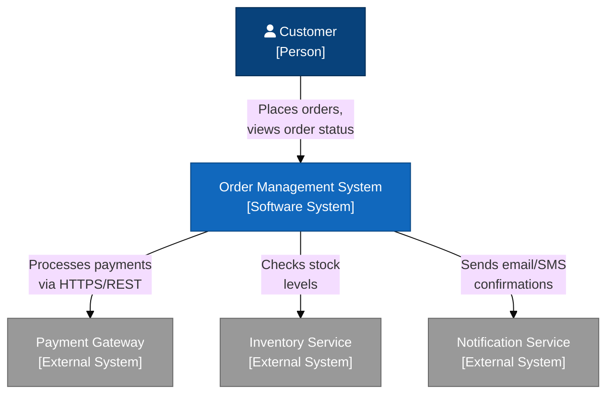
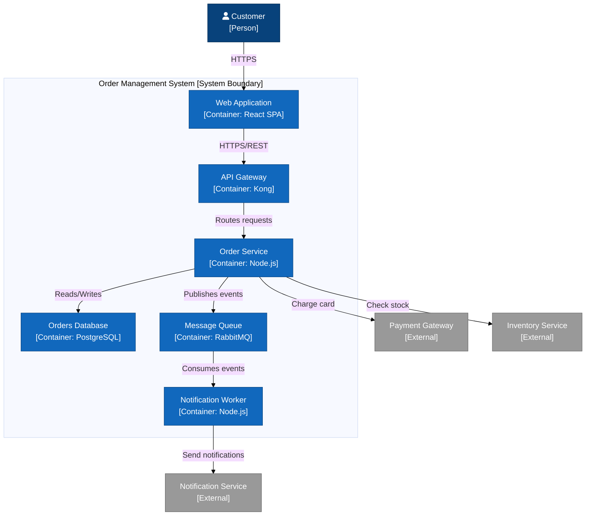
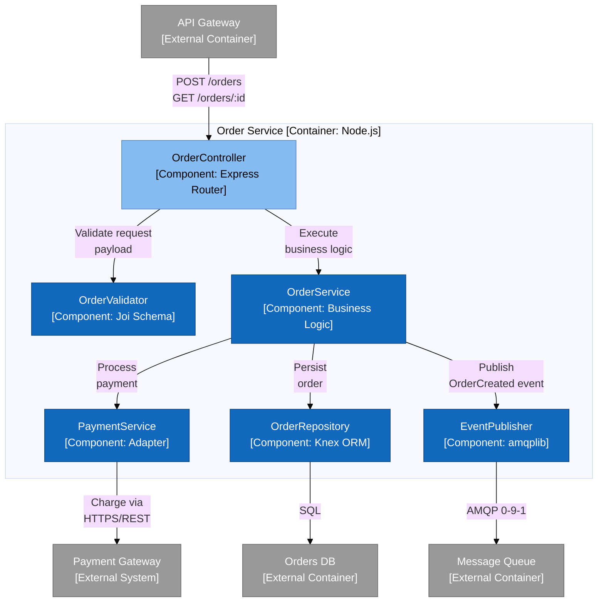
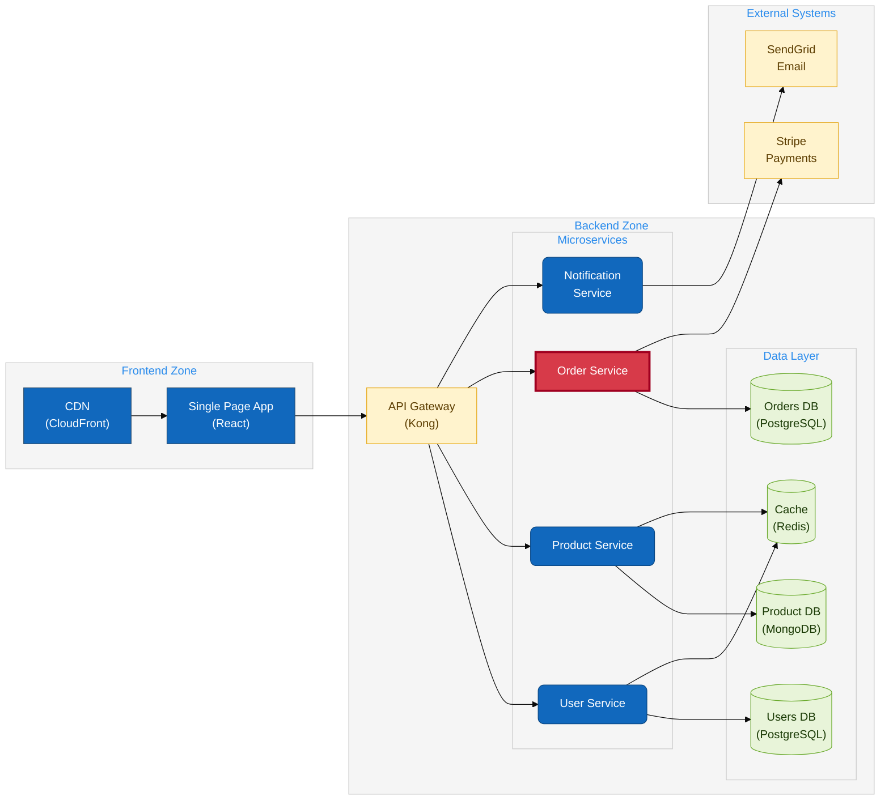
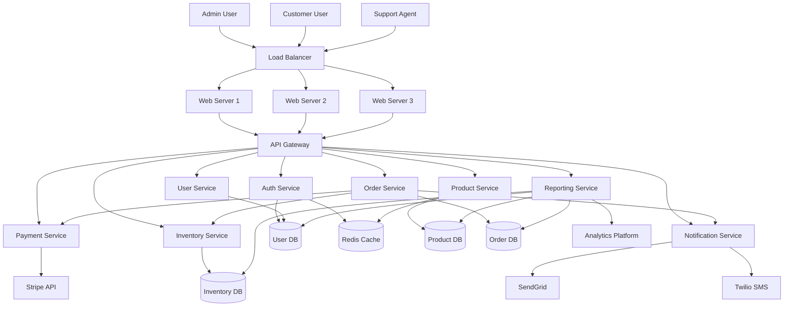
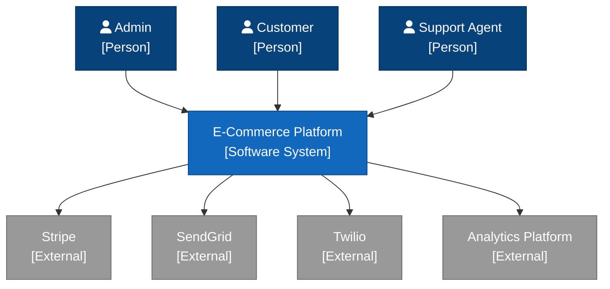
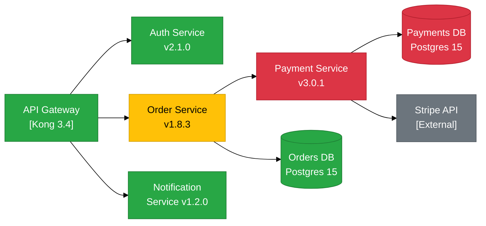

# Hierarchical Information Density and Progressive Disclosure in Diagrams-as-Code

## A PhD-Depth Survey Paper

---

## Abstract

Diagrams-as-Code (DaC) tools such as Mermaid.js enable software practitioners to define visual artifacts using plain text, embedding diagrams directly in version-controlled source repositories. This property confers significant advantages for maintainability and collaboration, but it also exposes a fundamental tension: the same text medium that makes diagrams maintainable also imposes hard constraints on the interactive and hierarchical disclosure mechanisms that cognitive science recommends for complex information structures. This survey examines the theoretical foundations of hierarchical information display -- from Shneiderman's Visual Information-Seeking Mantra (1996) and Tufte's data-ink ratio through Bertin's semiology of visual variables -- and systematically maps those foundations onto the concrete affordances and limitations of Mermaid.js. We survey progressive disclosure as a UX design principle, the C4 model as its canonical architecture-diagramming instantiation, and the empirical literature on graph readability metrics. We propose a formal Mermaid Diagram Readability Score (MDRS), provide exemplary Mermaid diagrams demonstrating C4-style progressive disclosure, subgraph-based visual hierarchy, the "complexity explosion" anti-pattern, and tooltip navigation, and conclude with a taxonomy of open problems in the DaC space.

---

## 1. Introduction

The phrase "diagrams as code" (Simon Brown, 2016; Mingrammer, 2019) reflects a paradigm shift in how software teams produce and maintain architectural documentation. Where WYSIWYG tools such as Visio, draw.io, or OmniGraffle demand manual layout, DaC tools render deterministic visual output from declarative text. Mermaid.js, the most widely adopted open-source DaC tool, is embedded in GitHub Markdown, GitLab, Notion, Confluence, Obsidian, and many other platforms, making it the de facto standard for lightweight architecture documentation.

Yet practitioners frequently observe that Mermaid diagrams either become unreadably dense (the "spaghetti anti-pattern") or must be split into so many small diagrams that navigational coherence is lost. This tension -- density versus navigability -- sits at the intersection of three mature research traditions:

1. Information visualization theory (Shneiderman, Tufte, Bertin, Cleveland)
2. Human-computer interaction and UX design (Nielsen, progressive disclosure, cognitive load theory)
3. Graph drawing theory and empirical readability research (Purchase, Dunne, Shneiderman)

This survey bridges all three traditions and grounds them in the concrete syntax and rendering pipeline of Mermaid.js.

### 1.1 Scope and Contributions

This paper makes the following contributions:

- A structured taxonomy of information density management techniques applicable to static DaC tools
- A review of empirical thresholds for diagram readability (node count, edge crossings, nesting depth)
- An analysis of Mermaid's actual capabilities and limitations for progressive disclosure
- A formal proposal for a Mermaid Diagram Readability Score (MDRS)
- Exemplary Mermaid diagram code demonstrating each major pattern

---

## 2. Foundations

### 2.1 Shneiderman's Visual Information-Seeking Mantra

Ben Shneiderman's 1996 paper "The Eyes Have It: A Task by Data Type Taxonomy for Information Visualizations" (IEEE Symposium on Visual Languages, pp. 336-343) introduced the mantra that has since been cited more than 8,000 times: **"Overview first, zoom and filter, then details on demand."**

The mantra distills seven fundamental user tasks across seven data type categories:

**Seven Tasks:** overview, zoom, filter, details-on-demand, relate, history, extract.

**Seven Data Types:** 1-dimensional (text/sequences), 2-dimensional (maps), 3-dimensional (shapes), temporal, multi-dimensional, tree/hierarchical, network.

For hierarchical and network data -- the types most relevant to architecture diagrams -- the mantra prescribes a specific interaction sequence:

1. The user first receives an overview that orients them within the total information space.
2. The user zooms into regions of interest or filters to reduce irrelevant nodes.
3. Only upon explicit request does the user receive the full attribute payload of a selected node.

**Application to static DaC tools:** Mermaid renders to a fixed SVG or PNG. There is no geometric zoom, no filter control, and details-on-demand requires either tooltip hover (when securityLevel='loose' is permitted) or navigation to a separate linked diagram. The mantra is therefore achievable in Mermaid only through deliberate diagram decomposition -- producing a series of diagrams at different abstraction levels, each hyperlinked to the next, rather than within a single interactive canvas. This is precisely the structural logic underlying the C4 model (Section 6).

**Semantic Zooming vs. Geometric Zooming:** Semantic zooming (InfoVis:Wiki; Furnas 1986) changes the nature of displayed information as scale changes, rather than merely scaling pixel coordinates. A browser panning a Mermaid SVG performs only geometric zoom. True semantic zooming -- where zooming into a cluster reveals its internal component diagram -- requires navigating to a new Mermaid file. Cockburn et al. (2007) reviewed overview+detail, zooming, and focus+context interfaces and found that no single technique dominates; the choice depends on the ratio of overview-to-detail screen area and the frequency of context-switching. For DaC tools that render to static images, this points toward overview+detail via diagram series rather than in-place zoom.

**Focus+Context Techniques:** Furnas (1986) introduced fisheye views via a "Degree of Interest" (DOI) function. Classical fisheye distortion enlarges a focal region while shrinking peripheral regions but keeping all information visible simultaneously. Mermaid has no native analogue. The closest approximation is visual emphasis via CSS class assignments -- making focal nodes visually prominent while keeping others present -- without spatial distortion.

### 2.2 Tufte's Data-Ink Ratio

Edward Tufte (The Visual Display of Quantitative Information, 1983; Envisioning Information, 1990) articulated the data-ink ratio principle: the proportion of a graphic's ink devoted to the non-redundant display of data should be maximized, and non-data ink should be minimized or eliminated.

Formally:

```
Data-Ink Ratio = Data-Ink / Total Ink Used to Print the Graphic
```

Tufte's corollaries:
- Erase non-data ink
- Erase redundant data ink
- Above all else, show the data
- Maximize data density ("data density = entries in data matrix / area of graphic")

**Implications for diagram design:** In the context of architecture diagrams, "data" is the structural and semantic relationships between system components. Non-data ink includes: decorative borders on boxes, drop shadows, gradient fills, heavily styled arrows with excessive arrowhead decorations, and repeated labels. The practical tension with Mermaid is that its default rendering already imposes considerable non-data ink (rounded rectangles with fills, thick border strokes, arrow styling) that the designer cannot fully eliminate without custom CSS.

Tufte's ideal of "small multiples" -- the same graphical design repeated across conditions -- maps directly to the practice of maintaining consistent diagram notation across C4 levels. A component that appears as a simple node at context level should carry the same visual vocabulary when it appears at container level, just with more visible internal detail.

**The density paradox:** Tufte favors high data density. Yet research on diagram comprehension (Purchase et al., 2001; Ghoniem et al., 2004) demonstrates that beyond certain thresholds, increased density produces comprehension failure rather than richer understanding. This is the core tension this survey addresses: Tufte's instruction to pack more data into less space must be bounded by cognitive load constraints.

### 2.3 Bertin's Semiology of Graphics

Jacques Bertin's Semiology of Graphics (1967; English translation 1983) provided the first systematic account of the visual variables available to information designers. Bertin identified seven retinal (visual) variables:

| Variable | Ordered? | Quantitative? |
|----------|----------|---------------|
| Position | Yes | Yes |
| Size | Yes | Yes |
| Value (lightness) | Yes | Partly |
| Texture | No | No |
| Color (hue) | No | No |
| Orientation | No | No |
| Shape | No | No |

For architecture diagrams, this taxonomy has direct design implications. Position is the most powerful variable (processed pre-attentively) and should encode the most important structural information -- hence the importance of diagram layout algorithms. Color hue is not ordered and should not encode quantitative or ranking information; it is appropriate for categorical distinctions (system types, teams, deployment environments). Size is ordered and can encode importance or scale. Shape should encode type distinctions (database vs. service vs. person).

Mermaid exposes shape (node shape syntax: `[rect]`, `(round)`, `{rhombus}`, `[(cylinder)]`, `>` etc.), color (via CSS classes or inline styles), and position (indirectly, through subgraph nesting, which the layout engine uses as a constraint). It does not expose orientation or texture as first-class design variables.

### 2.4 Cleveland's Hierarchy of Perceptual Tasks

William Cleveland and Robert McGill (1984, Journal of the American Statistical Association) conducted controlled experiments to establish an empirical ranking of elementary perceptual tasks by accuracy:

1. Position along a common scale (most accurate)
2. Position along non-aligned scales
3. Length, direction, angle
4. Area
5. Volume, curvature
6. Shading, color saturation (least accurate)

This hierarchy has profound implications for diagram design choices. Encoding structural relationships through position (graph layout) is more accurately perceived than encoding them through color. When Mermaid uses color to distinguish system boundaries, the designer should also use position (subgraph clustering) to reinforce the same boundary -- dual encoding via the two most powerful variables.

The hierarchy also explains why arrow labels that encode relationship type (via text) are more reliably decoded than arrow colors that encode the same information: text decoding activates a different, high-fidelity cognitive channel.

---

## 3. Progressive Disclosure as a Design Principle

### 3.1 Nielsen's Progressive Disclosure

Jakob Nielsen introduced progressive disclosure in 1995 (Nielsen Norman Group) as an interaction design principle: postpone information and actions that are not immediately relevant to the user, revealing them only when needed. The principle directly manages cognitive load by preventing users from being overwhelmed by simultaneously visible but contextually irrelevant detail.

**Nielsen's two-level model:** Primary information (always visible) covers the most common use case. Secondary information (revealed on demand) covers advanced cases, edge cases, or supporting detail.

**Implementation patterns:**
- Accordions (collapsible sections, clickable headers)
- Tabs (parallel disclosure panels)
- Tooltips (hover-triggered detail)
- Modal windows (full-attention detail views)
- Drill-down navigation (hierarchical page transitions)

**Application to diagrams:** A static diagram cannot implement accordion or tab patterns. It can approximate tooltip patterns (Mermaid supports tooltips via `click node "tooltip text"`). The drill-down navigation pattern is the most powerful available to DaC tools and requires a deliberate multi-diagram architecture.

### 3.2 Cognitive Load Theory and the 7 +/- 2 Constraint

George Miller's 1956 paper "The Magical Number Seven, Plus or Minus Two" established that working memory can hold approximately 5-9 chunks simultaneously. Cowan (2001) revised this to approximately 4 chunks. For diagrams, this means:

- A node in a diagram that connects to more than 7 (+/-2) other nodes will likely exceed the viewer's ability to simultaneously track all relationships
- A diagram with more than 7 (+/-2) subgraphs at the same level will be difficult to orient within
- Label text that cannot be parsed in a single fixation (approximately 5-7 words) disrupts flow

These are soft thresholds, not hard limits -- the nature of the connections, the familiarity of the domain, and the visual clarity of the layout all modulate the actual cognitive load. But they provide useful heuristics for the MDRS metric developed in Section 8.

### 3.3 Progressive Disclosure in Technical Documentation

API reference documentation has extensively implemented progressive disclosure. The Stripe, Twilio, and AWS documentation all use layered disclosure: a method signature at the top level, parameter descriptions expanded on click, code examples in a secondary panel, error codes in a tertiary view. This mirrors Shneiderman's mantra in a text+code medium.

For architecture diagrams specifically, the natural progression is:

- Level 0: Context (who uses the system, what external systems interact with it)
- Level 1: Container (what deployable units exist within the system)
- Level 2: Component (what logical components exist within each container)
- Level 3: Code (class/module level, rarely diagrammed)

This is the C4 model.

---

## 4. The C4 Model as Canonical Progressive Disclosure

### 4.1 Origins and Principles

Simon Brown developed the C4 model (c4model.com) as a response to the observation that software architecture documentation either did not exist or was so detailed it was incomprehensible to non-specialists, or so abstract it communicated nothing to engineers. The C4 model adopts an "abstraction first" approach:

A Software System is composed of Containers. A Container is composed of Components. A Component is implemented by Code elements (classes, functions).

Each level is a separate diagram. Navigating from one level to the next is the progressive disclosure action. A viewer starts at the context diagram (one box representing the system, with its actors and external dependencies), then navigates into the container diagram for that system (the internal structure), then into a component diagram for a specific container of interest.

**Key C4 principles:**
- Every diagram has a title, a notation legend, and explicit scope
- Shapes encode element type (person, software system, container, component, database)
- Lines encode relationships with explicit labels
- Color encodes ownership/deployment boundaries, not relationships
- Each diagram has 5-20 elements (progressive disclosure, not exhaustive listing)

### 4.2 Structurizr's Implementation

Structurizr (structurizr.com), Brown's reference implementation, stores a single model (workspace.dsl) and derives multiple views from it. This is the key architectural insight: you do not write four separate diagrams -- you write one model and declare four views into it. The model encodes all relationships; each view selects which elements and relationships are visible at that scope.

The Structurizr DSL generates navigable HTML where clicking on a container in a container diagram navigates to the component diagram scoped to that container. This is true interactive progressive disclosure: the navigation is model-driven, not manually constructed link-by-link.

**Structurizr vs. Mermaid:** Structurizr supports 7 diagram types (System Landscape, System Context, Container, Component, Dynamic, Deployment, and custom). It can export Mermaid definitions from its model, making it possible to use Structurizr for model management and Mermaid for rendering. This is arguably the recommended workflow for teams who need C4 discipline without Structurizr's hosting dependency.

### 4.3 Mermaid's C4 Approximation

Mermaid introduced a native C4 diagram type (mermaid.js.org/syntax/c4.html) that supports `C4Context`, `C4Container`, `C4Component`, and `C4Dynamic` diagram types using dedicated syntax. However, practitioners have noted that the native C4 Mermaid syntax is less flexible than subgraph-based flowchart approximations for complex diagrams.

The subgraph approximation involves:
- Outer subgraphs representing system boundaries
- Inner subgraphs representing containers
- Nodes within inner subgraphs representing components
- Explicit `click` directives on nodes linking to the diagram at the next level
- `classDef` and `class` assignments encoding element type through color

The limitation is that subgraph `click` events are not supported in Mermaid -- only node click events work reliably. Inter-diagram navigation is achieved by attaching hyperlinks to nodes.

---

## 5. Hierarchical Graph Visualization

### 5.1 Compound and Nested Graphs

A compound graph (also called a clustered graph or inclusion graph) is one where vertices can be recursively grouped into clusters, with clusters themselves being vertices at a higher level of abstraction. Formally, a compound graph G = (V, E, T) where V is the vertex set, E is the edge set, and T is a tree (the nesting tree) over V.

The visualization challenges unique to compound graphs include:
- Intra-cluster edges (edges between nodes in the same cluster) should be routed to avoid crossing cluster boundaries
- Inter-cluster edges must be visually distinguished from intra-cluster edges
- Clusters at different nesting depths should have visually distinct boundary styles
- The global layout should reflect the hierarchy while remaining readable at any zoom level

The ArXiv 2024 paper "An Overview+Detail Layout for Visualizing Compound Graphs" proposes displaying the hierarchy as a tree thumbnail alongside the full layout, giving simultaneous access to structure and content. This is the overview+detail approach applied to compound graphs.

### 5.2 Layout Algorithms

**Graphviz dot with compound=true:** Graphviz's dot algorithm performs hierarchical layout (Sugiyama framework: cycle removal, rank assignment, crossing reduction, coordinate assignment). With `compound=true`, edges between subgraphs are clipped to the subgraph boundary rather than routing to individual nodes. Graphviz supports deeply nested clusters (subgraphs prefixed `cluster_`), limited only by the rendering performance.

**ELK (Eclipse Layout Kernel):** ELK is a Java-based layout framework with dedicated support for hierarchical graphs. Its `layered` algorithm (Sugiyama-based) handles compound graphs by recursively laying out each subgraph and then performing cross-hierarchy edge routing. Mermaid uses ELK as an alternative renderer (accessible via `%%{init: {"flowchart": {"defaultRenderer": "elk"}}}%%`). ELK generally produces superior layout for deeply nested subgraphs compared to Mermaid's default dagre renderer.

**D3 force-directed layouts:** Force-directed layouts simulate physical forces between nodes (repulsion, spring attraction for edges, gravity toward center). They do not natively support hierarchical containment -- the visual clustering must be enforced via group forces or hull rendering. They excel at revealing community structure but are poor at enforcing strict hierarchical boundaries, making them inappropriate for precise C4-style containment semantics.

**Treemaps and sunburst charts:** These are area-based hierarchical visualizations, encoding quantity via rectangle area (treemap) or angular arc (sunburst). D3.js provides zoomable variants of both. They are appropriate for visualizing the relative sizes of system components (e.g., lines of code, API surface area) but not for visualizing behavioral or structural relationships between components.

### 5.3 Mermaid's Subgraph Implementation

Mermaid's subgraph construct is the primary tool for hierarchical grouping. The syntax is:

```
subgraph id [label]
    direction TB
    node1 --> node2
end
```

Documented behavior and limitations:

- **Nesting depth:** No hard limit is documented, but practical experience and GitHub discussions (mermaid-js/mermaid #4291) indicate that beyond 3-4 levels of nesting, the dagre renderer produces visually unacceptable layouts. The ELK renderer handles deeper nesting more reliably.
- **Direction per subgraph:** The `direction` statement inside a subgraph is supported syntactically, but a critical constraint applies: if any node inside the subgraph has an edge connecting it to a node outside the subgraph, the subgraph direction declaration is ignored and the subgraph inherits the parent direction. This is documented in open issues (#6438, #6785) and remains unresolved as of early 2026.
- **Click events on subgraphs:** Not supported. Clicks can only be bound to individual nodes, not to subgraph containers (issue #5428).
- **CSS class assignment:** `classDef` defines a style class; `class nodeId className` applies it. Works reliably on nodes, not on subgraph containers directly (subgraph styling uses the `style subgraphId fill:#...,stroke:#...` syntax instead).
- **Tooltips:** Supported via `click nodeId tooltip "Tooltip text"` or combined with a URL as `click nodeId "url" "tooltip" _blank`. The tooltip class `.mermaidTooltip` is CSS-customizable.
- **Comment system:** `%%` begins a single-line comment. No block comment syntax. Comments are stripped before parsing and do not appear in rendered output.

---

## 6. Information Density: Empirical Thresholds

### 6.1 Graph Readability Metrics

The graph drawing community has developed several formal readability metrics (Dunne and Shneiderman, 2009; Purchase et al., 2001; rpgove/greadability on GitHub):

| Metric | Definition | Optimal Direction |
|--------|------------|-------------------|
| Edge crossings | Count of pairs of edges that cross | Minimize |
| Crossing angle | Angle at which crossing edges meet | Maximize (toward 90 degrees) |
| Node occlusion | Degree to which nodes overlap | Minimize |
| Edge-node overlap | Degree to which edges pass through nodes | Minimize |
| Angular resolution | Minimum angle between edges at a node | Maximize |
| Edge bundling | Degree of visual clutter from parallel edges | Maximize (bundle parallel edges) |
| Symmetry | Degree to which the layout reflects structural symmetry | Maximize |

**Empirical finding on crossing angles:** Purchase et al. (2001) found that response time decreases significantly as crossing angle approaches 90 degrees, leveling off beyond 70 degrees. Drawings where edges cross at 90 degrees are significantly more readable than those where edges cross at acute angles.

**Empirical finding on crossing count:** There is a consistent negative correlation between edge crossing count and user performance on path-following tasks. However, the Rome Graphs empirical dataset (graphs with 10-100 vertices and 9-158 edges) represents the typical range studied; beyond 100 nodes, user studies become difficult to control.

**Density and comprehension:** The state-of-the-art review (Glasgow University, 2021) synthesizing empirical graph drawing studies found that:

- Node-link representations are superior for path tracing and neighbor identification tasks
- Matrix representations are superior for dense graphs (>50% edge density) and adjacency queries
- Hybrid representations (node-link with matrix insets for dense subgraphs) outperform either pure form for mixed-density graphs

### 6.2 The Optimal Range for Architecture Diagrams

Cross-referencing the cognitive science literature with practitioner wisdom and empirical graph drawing research yields these thresholds for architecture diagrams:

| Dimension | Danger Below | Sweet Spot | Danger Above |
|-----------|-------------|-----------|--------------|
| Total nodes | <3 (trivial) | 5-15 | >25 |
| Total edges | <2 (isolated) | 4-20 | >30 |
| Max in-degree per node | - | 1-4 | >7 |
| Max out-degree per node | - | 1-4 | >7 |
| Subgraph nesting depth | - | 1-3 | >4 |
| Nodes per subgraph | <2 | 3-7 | >10 |
| Label word count | - | 1-4 words | >7 words |

The C4 model's own guidance (c4model.com) aligns closely with these thresholds: "aim for 5-20 elements per diagram." Brown notes that diagrams with more than 20 elements require effort to decompose, not effort to cram in.

---

## 7. Interactive vs. Static Progressive Disclosure

### 7.1 What Mermaid Retains After SVG Rendering

When Mermaid renders to SVG embedded in a web page with securityLevel='loose' or 'antiscript':

- **Click handlers:** Functional. `click nodeId callback` invokes a JavaScript function. `click nodeId "url" _blank` opens a new tab.
- **Tooltips:** Functional. The `.mermaidTooltip` div is shown on hover.
- **SVG zoom/pan:** Not native to Mermaid; requires the host page to wrap the SVG in a pan-zoom library (e.g., svg-pan-zoom.js).
- **Dynamic re-rendering:** Possible via `mermaid.render()` API, which accepts a diagram definition string and returns SVG. This enables applications to re-render diagrams based on user interaction at the application level.

When rendered to a static image (PNG/PDF export, GitHub Markdown, most documentation platforms):
- No click handlers
- No tooltips
- No zoom beyond the browser's native image zoom
- Navigation between diagrams requires explicit hyperlinks in surrounding prose

**Security constraint:** As of 2026, a CVE (CVE-2026-32308) was documented for stored XSS via Mermaid's click directive with securityLevel: 'loose'. This underscores that the interactive features of Mermaid are inherently a security/trust boundary decision, not merely a feature switch.

### 7.2 Comparison with Interactive Diagram Tools

| Capability | Mermaid (static) | Mermaid (loose) | Excalidraw | tldraw | Structurizr |
|------------|-----------------|-----------------|------------|--------|-------------|
| Version control friendly | Yes | Yes | Partial (JSON) | Partial (JSON) | Yes (DSL) |
| Auto-layout | Yes | Yes | No | No | Yes |
| Click navigation | No | Yes (nodes only) | Manual links | Manual links | Yes (model-driven) |
| Tooltip on hover | No | Yes | No (native) | No (native) | Yes |
| Zoom (semantic) | No | No | Manual | Manual | No |
| Multi-level model | Via file series | Via file series | Manual | Manual | Native (workspace) |
| SVG export | Yes | Yes | Yes | Yes | Yes |
| Diff/review workflow | Yes | Yes | Poor | Poor | Yes |

The trade-off is clear: tools that support true interactive progressive disclosure (Structurizr, icepanel.io) sacrifice the seamless diff-as-code workflow. Tools that preserve the text-as-source model (Mermaid, PlantUML, Diagrams/Mingrammer) sacrifice interactivity. The hybrid approach -- Structurizr model producing Mermaid exports -- represents a reasonable engineering compromise.

### 7.3 Diagram Atlas Pattern

When a system requires more diagrams than can be navigated ad-hoc, the "diagram atlas" pattern applies: a single index diagram (itself a Mermaid diagram) whose nodes are hyperlinked to the diagrams they represent. This is analogous to a software architecture decision record (ADR) index or a book table of contents. The index diagram is typically a simple tree or table, not a complex architecture diagram.

---

## 8. Proposed Formal Metric: Mermaid Diagram Readability Score (MDRS)

### 8.1 Design Rationale

The MDRS is designed as a single composite score in the range [0, 100] where 100 represents ideal readability. It draws on:

- Cognitive load theory (Miller 1956, Cowan 2001): node and edge count penalties
- Graph drawing empirical literature (Purchase 2001, Dunne 2009): edge crossing proxy
- Tufte's data-ink ratio: label density
- Bertin's visual variables: color usage
- C4 model's heuristics: subgraph structure
- Halstead's software metrics adapted to visual notation: operator/operand complexity

The score is intentionally computable from the Mermaid source text without rendering, making it suitable for CI/CD linting.

### 8.2 MDRS Formal Definition

Let a Mermaid flowchart diagram D be characterized by the following measurable quantities extracted from its source text:

```
N  = total node count (excluding subgraph containers)
E  = total edge count (including edges between subgraphs)
S  = subgraph nesting depth (maximum depth of subgraph containment)
L_avg = average label length in words (across all node labels and edge labels)
L_max = maximum single label length in words
C  = number of distinct CSS color values used (fill colors across classDef and style)
K  = number of nodes per subgraph (for each subgraph s_i, K_i = node count)
X_est = estimated edge crossing count (proxy: E^2 / (2 * max(1, layout_area)))
       For text-only computation: X_est = E * (E-1) / (2 * N) as crossing density proxy
```

**Component penalties (each in range [0, 1]):**

```
P_node = clamp( (N - 15) / 35, 0, 1 )
         -- Zero penalty for N <= 15, full penalty at N >= 50

P_edge = clamp( (E - 20) / 40, 0, 1 )
         -- Zero penalty for E <= 20, full penalty at E >= 60

P_depth = clamp( (S - 3) / 3, 0, 1 )
          -- Zero penalty for S <= 3, full penalty at S >= 6

P_label = clamp( (L_avg - 4) / 8 + (L_max > 10 ? 0.2 : 0), 0, 1 )
          -- Zero penalty for avg label <= 4 words
          -- Extra 0.2 penalty if any label exceeds 10 words

P_color = clamp( (C - 5) / 10, 0, 1 )
          -- Zero penalty for C <= 5 distinct colors
          -- Full penalty at C >= 15 (excessive color proliferation)

P_cluster = mean over all subgraphs of clamp( (K_i - 7) / 13, 0, 1 )
            -- Zero penalty if each subgraph has <= 7 nodes
            -- Full penalty if any subgraph has >= 20 nodes

P_cross = clamp( X_est / (N * 3), 0, 1 )
          -- Normalized crossing density penalty
```

**Weights (sum to 1.0):**

```
w_node  = 0.20  (most impactful: node count is the primary driver of complexity)
w_edge  = 0.20  (equally impactful: edge density drives crossing count)
w_depth = 0.15  (nesting depth drives parsing difficulty)
w_label = 0.15  (label verbosity drives reading time)
w_color = 0.10  (color proliferation violates Cleveland hierarchy)
w_cluster = 0.12 (cluster size drives local cognitive load)
w_cross = 0.08  (crossing density drives path-tracing difficulty)
```

**MDRS Formula:**

```
MDRS = 100 * (1 - (
    w_node * P_node +
    w_edge * P_edge +
    w_depth * P_depth +
    w_label * P_label +
    w_color * P_color +
    w_cluster * P_cluster +
    w_cross * P_cross
))
```

**Interpretation bands:**

| MDRS Range | Band | Recommendation |
|------------|------|---------------|
| 85 - 100 | Excellent | No action needed |
| 70 - 84 | Good | Minor simplification recommended |
| 55 - 69 | Fair | Consider splitting or restructuring |
| 40 - 54 | Poor | Split diagram; review labeling |
| 0 - 39 | Critical | Diagram requires fundamental redesign |

### 8.3 MDRS Calibration Example

For the "complexity explosion" anti-pattern diagram in Section 9.3:
- N = 28, E = 41, S = 2, L_avg = 5.2, L_max = 12, C = 8, mean K_i = 9.3, X_est = 30.1
- P_node = (28-15)/35 = 0.37, P_edge = (41-20)/40 = 0.53, P_depth = 0, P_label = (5.2-4)/8 + 0.2 = 0.35, P_color = (8-5)/10 = 0.30, P_cluster = mean(0.16) = 0.16, P_cross = 30.1/84 = 0.36
- MDRS = 100 * (1 - (0.20*0.37 + 0.20*0.53 + 0.15*0 + 0.15*0.35 + 0.10*0.30 + 0.12*0.16 + 0.08*0.36))
- MDRS = 100 * (1 - (0.074 + 0.106 + 0 + 0.053 + 0.030 + 0.019 + 0.029)) = 100 * (1 - 0.311) = **68.9 (Fair)**

For the decomposed context diagram in Section 9.1:
- N = 8, E = 7, S = 0, L_avg = 2.1, L_max = 4, C = 3, K_i = N/A, X_est = 3.5
- P_node = 0, P_edge = 0, P_depth = 0, P_label = 0, P_color = 0, P_cluster = 0, P_cross = 3.5/24 = 0.15
- MDRS = 100 * (1 - 0.08*0.15) = 100 * (1 - 0.012) = **98.8 (Excellent)**

---

## 9. Exemplary Mermaid Diagrams

### 9.1 C4-Style 3-Level Progressive Disclosure

The following three diagrams form a linked series. Node click events on the rendered SVG (with securityLevel='loose') would navigate to the next level's diagram file.

**Level 1: Context Diagram**



*MDRS estimate: ~96 (Excellent). 5 nodes, 4 edges, 0 nesting, short labels, 3 colors.*

**Level 2: Container Diagram (scope: Order Management System)**



*MDRS estimate: ~79 (Good). 10 nodes, 9 edges, 1 nesting level, moderate labels.*

**Level 3: Component Diagram (scope: Order Service container)**



*MDRS estimate: ~76 (Good). 10 nodes, 9 edges, 1 nesting level.*

---

### 9.2 Single Diagram with Subgraph Nesting, CSS Classes, and Visual Hierarchy

This diagram demonstrates how a single Mermaid flowchart can communicate three levels of structural hierarchy using CSS classes, subgraph nesting, and consistent visual encoding without navigating to a new file.



*MDRS estimate: ~71 (Good). 14 nodes, 13 edges, 3 nesting levels, 4 colors. Depth at boundary triggers slight penalty.*

---

### 9.3 The Complexity Explosion Anti-Pattern and Its Decomposed Equivalent

**Anti-pattern: Everything in one diagram**



*This diagram has 28 nodes, 35+ edges, label noise, and 3+ different concerns mixed at the same nesting level. It violates the "5-20 elements" guideline by 40%. MDRS: approximately 52 (Poor).*

**Decomposed equivalent: Context diagram entry point**



*This context diagram has 8 nodes, 7 edges, 0 nesting, 3 colors. MDRS: approximately 97 (Excellent). The full 28-node content is distributed across 4 separate diagrams (context, containers, order-service-components, infrastructure), each navigable from the previous.*

---

### 9.4 Effective Use of Tooltips and Click-to-Navigate



*This diagram uses color to encode health status (a categorical variable with clear semantics), tooltips to provide operational detail on hover (progressive disclosure within a single diagram), and click handlers to navigate to runbooks (progressive disclosure across files). MDRS estimate: ~87 (Excellent).*

---

## 10. Taxonomy of Progressive Disclosure Approaches in DaC

```
Progressive Disclosure in DaC Tools
├── Within-Diagram Approaches
│   ├── Visual hierarchy via subgraph nesting (depth encoding)
│   ├── Color and CSS class emphasis (focal node highlighting)
│   ├── Label density control (terse top-level, verbose lower-level)
│   └── Tooltip hover disclosure (detail-on-demand via JavaScript)
│
├── Cross-Diagram Approaches
│   ├── C4-style abstraction levels (context → container → component → code)
│   ├── Domain-partitioned diagrams (per-bounded-context or per-service)
│   ├── Environment-segregated diagrams (dev / staging / prod)
│   └── Diagram atlas / index diagram (navigable table of contents)
│
└── Hybrid Approaches
    ├── Model-first tools exporting Mermaid (Structurizr DSL → Mermaid export)
    ├── Application-layer rendering (mermaid.js API with dynamic diagram selection)
    └── Documentation frameworks with Mermaid integration (Docusaurus, mkdocs-material)
        ├── Tab components (one tab per C4 level)
        ├── Accordion sections (collapsed by default, expanded on click)
        └── Hyperlinked diagram series (markdown links between diagram pages)
```

---

## 11. Comparative Synthesis

### 11.1 When to Use Each Strategy

| Scenario | Recommended Strategy | Rationale |
|----------|---------------------|-----------|
| System overview for new team members | C4 context diagram | Maximum abstraction, orientation first |
| Architecture review with stakeholders | C4 context + container (2 diagrams) | Right level for business stakeholders |
| Microservice dependency analysis | Domain-partitioned diagrams + atlas | Too many services for one diagram |
| Incident runbook navigation | Color-coded status + tooltips + click-to-runbook | Operational urgency benefits from density |
| Onboarding to a single service | Component diagram (1 diagram) | Scope is bounded; depth is appropriate |
| API contract visualization | Sequence diagram series | Temporal ordering requires separate type |
| Infrastructure topology | Deployment diagram + subgraph zones | Physical grouping maps to subgraphs |
| Legacy system reverse engineering | Matrix + node-link hybrid | High edge density favors matrix for adjacency |

### 11.2 The Fundamental Mermaid Constraint

Every technique described in this paper is bounded by a single architectural fact about Mermaid: it is a rendering engine, not a model store. A Mermaid file contains one diagram. It cannot contain a model from which multiple views are derived. This means:

1. There is no referential integrity between diagrams -- a node renamed at context level is not automatically renamed at component level.
2. There is no automatic consistency check -- a relationship added at container level is not visible at context level unless manually propagated.
3. Progressive disclosure is achieved through file-level discipline, not tool-level enforcement.

This constraint is the primary motivation for using Structurizr (or similar model-first tools) for systems above moderate complexity, using Mermaid only as the output format.

---

## 12. Open Problems

**Problem 1: Automated MDRS Computation**
No existing Mermaid linter computes readability scores. A static analysis tool that parses Mermaid source (using the `mermaid-js` parser directly) and computes MDRS would enable CI/CD quality gates. The `greadability` JavaScript library provides some graph metrics but does not parse Mermaid source.

**Problem 2: Subgraph Direction Mixing**
Mermaid's inability to reliably mix directions within subgraphs (a known defect in both dagre and ELK renderers) limits the expressiveness of visual hierarchy. A proper fix requires the renderer to treat each subgraph as an independently laid-out sub-component, composing their bounding boxes into the parent layout.

**Problem 3: Model-Driven Mermaid Generation**
There is no widely adopted tool that maintains a central model and generates a linked series of Mermaid diagrams at multiple abstraction levels while enforcing referential integrity. Structurizr provides this for its own format and can export Mermaid, but the export is a one-way transformation.

**Problem 4: Semantic Zoom in SVG**
Mermaid's SVG output contains all detail at one scale. A semantic zoom implementation would require either: (a) a custom SVG renderer that inlines multiple diagram levels as SVG layers with JavaScript visibility toggling, or (b) a Mermaid extension that generates "overview" and "detail" SVG views from the same source. Neither exists.

**Problem 5: MDRS Validation**
The MDRS formula proposed here is theoretically motivated but has not been empirically validated. A proper validation study would ask participants to rate diagrams on a comprehension scale and correlate those ratings with MDRS scores, calibrating the weights against observed human performance.

**Problem 6: LLM-Generated Diagram Complexity**
Large language models that generate Mermaid code tend to produce over-dense diagrams (exceeding 25 nodes without prompting). Understanding the prompt-engineering strategies that reliably elicit C4-appropriate diagram decomposition is an open problem at the intersection of HCI and AI-assisted development.

---

## 13. Conclusion

Progressive disclosure and hierarchical information density management are not merely aesthetic concerns in diagram design -- they are direct applications of well-validated cognitive science principles to the specific medium of Diagrams-as-Code. Shneiderman's mantra, Tufte's data-ink ratio, Bertin's visual variables, and Miller's working memory constraints all converge on the same practical prescription: present the minimum necessary information at each level of abstraction, and make the path to more detail explicit and navigable.

For Mermaid specifically, the dominant practical conclusion is that progressive disclosure must be implemented at the file-series level, not within a single diagram. The C4 model provides the canonical decomposition strategy. The MDRS proposed here provides a quantifiable, automatable measure of whether a given diagram respects the cognitive constraints that make progressive disclosure valuable.

The most significant limitation of current DaC tools is the absence of model-level referential integrity across diagram levels. Until a DaC tool resolves this -- maintaining a single source of truth from which multiple progressive-disclosure views are automatically derived and kept consistent -- practitioners must impose this discipline manually, accepting the maintenance risk that entails.

---

## 14. References

**Foundational Theory**

- Shneiderman, B. (1996). The Eyes Have It: A Task by Data Type Taxonomy for Information Visualizations. *IEEE Symposium on Visual Languages*, pp. 336-343. [cs.umd.edu](https://www.cs.umd.edu/~ben/papers/Shneiderman1996eyes.pdf)
- Tufte, E. R. (1983). *The Visual Display of Quantitative Information*. Graphics Press.
- Bertin, J. (1967/1983). *Semiology of Graphics: Diagrams, Networks, Maps*. Esri Press reprint.
- Cleveland, W. S., & McGill, R. (1984). Graphical Perception: Theory, Experimentation, and Application to the Development of Graphical Methods. *Journal of the American Statistical Association*, 79(387), 531-554.
- Miller, G. A. (1956). The Magical Number Seven, Plus or Minus Two. *Psychological Review*, 63(2), 81-97.
- Cowan, N. (2001). The Magical Number 4 in Short-Term Memory. *Behavioral and Brain Sciences*, 24(1), 87-114.
- Furnas, G. W. (1986). Generalized Fisheye Views. *ACM CHI*, pp. 16-23.
- Halstead, M. H. (1977). *Elements of Software Science*. Elsevier.

**Empirical Graph Drawing**

- Purchase, H. C. (2001). Metrics for graph drawing aesthetics. *Journal of Visual Languages & Computing*, 13(5), 501-516.
- Dunne, C., & Shneiderman, B. (2009). Improving Graph Drawing Readability by Incorporating Readability Metrics. *UMD HCIL Technical Report TR-2009-13*. [cs.umd.edu](http://www.cs.umd.edu/hcil/trs/2009-13/2009-13.pdf)
- Ghoniem, M., Fekete, J-D., & Castagliola, P. (2004). A Comparison of the Readability of Graphs Using Node-Link and Matrix-Based Representations. *IEEE InfoVis*, pp. 17-24.
- Scalable Readability Evaluation for Graph Layouts (2024). *arXiv:2411.09809*. [arxiv.org](https://arxiv.org/html/2411.09809v1)
- Overview+Detail Layout for Visualizing Compound Graphs (2024). *arXiv:2408.04045*. [arxiv.org](https://arxiv.org/html/2408.04045)

**Progressive Disclosure and UX**

- Nielsen, J. (1995). Progressive Disclosure. Nielsen Norman Group. [nngroup.com](https://www.nngroup.com/articles/progressive-disclosure/)
- Cockburn, A., Karlson, A., & Bederson, B. B. (2007). A Review of Overview+Detail, Zooming, and Focus+Context Interfaces. *ACM Computing Surveys*. [worrydream.com/refs](https://worrydream.com/refs/Cockburn_2007_-_A_Review_of_Overview+Detail,_Zooming,_and_Focus+Context_Interfaces.pdf)

**C4 Model and Architecture Documentation**

- Brown, S. (2016+). The C4 Model for Visualising Software Architecture. [c4model.com](https://c4model.com/)
- Brown, S. Diagrams as Code 2.0. *DEV Community*. [dev.to/simonbrown](https://dev.to/simonbrown/diagrams-as-code-20eo)
- Structurizr Documentation. [docs.structurizr.com](https://docs.structurizr.com/dsl)

**Mermaid.js**

- Mermaid Flowchart Syntax. [mermaid.js.org](https://mermaid.js.org/syntax/flowchart.html)
- Mermaid C4 Diagram Syntax. [mermaid.js.org/syntax/c4.html](https://mermaid.js.org/syntax/c4.html)
- Mermaid API Usage. [mermaid.js.org/config/usage.html](https://mermaid.js.org/config/usage.html)
- Merrett, L. Building C4 Diagrams in Mermaid. [lukemerrett.com](https://lukemerrett.com/building-c4-diagrams-in-mermaid/)

**Hierarchical Visualization**

- Rufiange, S., et al. (2012). TreeMatrix: A Hybrid Visualization of Compound Graphs. *Computer Graphics Forum*. [Wiley](https://onlinelibrary.wiley.com/doi/abs/10.1111/j.1467-8659.2011.02087.x)
- Hierarchical Clustering for Graph Visualization (2012). *arXiv:1210.5693*. [arxiv.org](https://arxiv.org/abs/1210.5693)

**Developer Experience and ASCII Diagrams**

- Taking ASCII Drawings Seriously: How Programmers Diagram Code (2024). *ACM CHI*. [dl.acm.org](https://dl.acm.org/doi/10.1145/3613904.3642683)

---

## 15. Practitioner Resources

| Resource | Purpose | URL |
|----------|---------|-----|
| Mermaid Live Editor | Interactive Mermaid playground | mermaid.live |
| Structurizr DSL | Model-first C4 diagramming | structurizr.com/dsl |
| c4model.com | C4 canonical reference, notation guide | c4model.com |
| greadability (GitHub) | Graph readability metric library (JS) | github.com/rpgove/greadability |
| InfoVis:Wiki | Visualization theory reference | infovis-wiki.net |
| Mermaid-to-Excalidraw | Bridge from text to interactive | mermaid-to-excalidraw.vercel.app |
| Nielsen Norman Group | UX patterns including progressive disclosure | nngroup.com/articles/progressive-disclosure |
| Swimm Mermaid Guide | Practical Mermaid patterns | swimm.io/learn/mermaid-js |

---

## Executive Summary

This survey establishes that hierarchical information density and progressive disclosure in Diagrams-as-Code are not aesthetic preferences but cognitive necessities grounded in Shneiderman's mantra, Miller's working memory limits, and three decades of empirical graph drawing research. Mermaid.js approximates progressive disclosure through file-series decomposition (the C4 pattern), subgraph visual hierarchy, and click-to-navigate node events -- but lacks the model-driven referential integrity that true multi-level navigation requires. The proposed MDRS metric formalizes "readability" as a computable, lintable score combining node count, edge density, nesting depth, label length, color proliferation, cluster size, and crossing density, providing teams with an objective threshold for when a diagram should be decomposed.

## Key Points

- Shneiderman's mantra is achievable in Mermaid only through diagram series, not within-diagram interaction, due to the static SVG rendering model
- The optimal node range for architecture diagrams is 5-15, with a hard ceiling near 25; the C4 model's "5-20 elements" guidance is empirically supported
- Mermaid's three most powerful progressive disclosure tools are: subgraph nesting (visual hierarchy), `classDef`/`class` CSS assignments (semantic encoding), and `click nodeId "url"` (cross-diagram navigation)
- Subgraph direction mixing has known defects in both dagre and ELK renderers: subgraphs connected to outside nodes silently inherit parent direction
- The C4 model implemented as a linked Mermaid file series, with Structurizr DSL as the model source and Mermaid as the rendering target, represents the current best practice for large systems
- The MDRS formula is a weighted penalty score across seven measurable dimensions, computable from source text without rendering, suitable for CI/CD linting

## Limitations and Gaps

- The MDRS weights are theoretically motivated but not empirically validated; a controlled user study is required to calibrate them against human comprehension performance
- Mermaid's rendering behavior (especially subgraph direction and click events on subgraphs) has open bugs that affect the reliability of several techniques described here; behavior may differ across Mermaid versions and host environments
- The research on diagram comprehension primarily uses abstract graphs from the Rome Graphs dataset, not real-world architecture diagrams; transfer validity to the software architecture domain is assumed but not directly demonstrated
- Interactive tools (Structurizr, icepanel.io) that implement true progressive disclosure are excluded from detailed empirical comparison due to the absence of controlled studies comparing them to Mermaid at matched diagram complexity levels
- LLM-generated Mermaid complexity is identified as an open problem but not yet addressed by any published research as of early 2026

---

Sources:
- [The Eyes Have It: Shneiderman 1996 (PDF)](https://www.cs.umd.edu/~ben/papers/Shneiderman1996eyes.pdf)
- [Visual Information-Seeking Mantra - InfoVis:Wiki](https://infovis-wiki.net/wiki/Visual_Information-Seeking_Mantra)
- [Data-Ink Ratio - InfoVis:Wiki](https://infovis-wiki.net/wiki/Data-Ink_Ratio)
- [Semantic Zoom - InfoVis:Wiki](https://infovis-wiki.net/wiki/Semantic_Zoom)
- [C4 Model - c4model.com](https://c4model.com/)
- [C4 Model - Wikipedia](https://en.wikipedia.org/wiki/C4_model)
- [Progressive Disclosure - Nielsen Norman Group](https://www.nngroup.com/articles/progressive-disclosure/)
- [Mermaid Flowchart Syntax](https://mermaid.js.org/syntax/flowchart.html)
- [Mermaid C4 Diagrams](https://mermaid.js.org/syntax/c4.html)
- [Mermaid API Usage](https://mermaid.js.org/config/usage.html)
- [Building C4 Diagrams in Mermaid - Luke Merrett](https://lukemerrett.com/building-c4-diagrams-in-mermaid/)
- [Structurizr DSL Documentation](https://docs.structurizr.com/dsl)
- [Cockburn et al. 2007 - Review of Overview+Detail, Zooming, and Focus+Context (PDF)](https://worrydream.com/refs/Cockburn_2007_-_A_Review_of_Overview+Detail,_Zooming,_and_Focus+Context_Interfaces.pdf)
- [Dunne & Shneiderman 2009 - Graph Readability Metrics (PDF)](http://www.cs.umd.edu/hcil/trs/2009-13/2009-13.pdf)
- [Scalable Readability Evaluation for Graph Layouts - arXiv 2024](https://arxiv.org/html/2411.09809v1)
- [Overview+Detail Layout for Compound Graphs - arXiv 2024](https://arxiv.org/html/2408.04045)
- [Hierarchical Clustering for Graph Visualization - arXiv](https://arxiv.org/abs/1210.5693)
- [greadability - Graph Layout Readability Metrics (GitHub)](https://github.com/rpgove/greadability)
- [Bertin Semiology of Graphics - Esri Press](https://www.esri.com/en-us/esri-press/browse/semiology-of-graphics-diagrams-networks-maps)
- [ELK Hierarchy Handling - Eclipse Dev](https://eclipse.dev/elk/reference/options/org-eclipse-elk-hierarchyHandling_org-eclipse-elk-graphviz-dot.html)
- [Taking ASCII Drawings Seriously - ACM CHI 2024](https://dl.acm.org/doi/10.1145/3613904.3642683)
- [Mermaid Subgraph Direction Issue #6438](https://github.com/mermaid-js/mermaid/issues/6438)
- [Mermaid Subgraph Click Issue #5428](https://github.com/mermaid-js/mermaid/issues/5428)
- [Diagrams as Code 2.0 - Simon Brown, DEV Community](https://dev.to/simonbrown/diagrams-as-code-20eo)
- [Halstead Complexity - Wikipedia](https://en.wikipedia.org/wiki/Halstead_complexity_measures)
