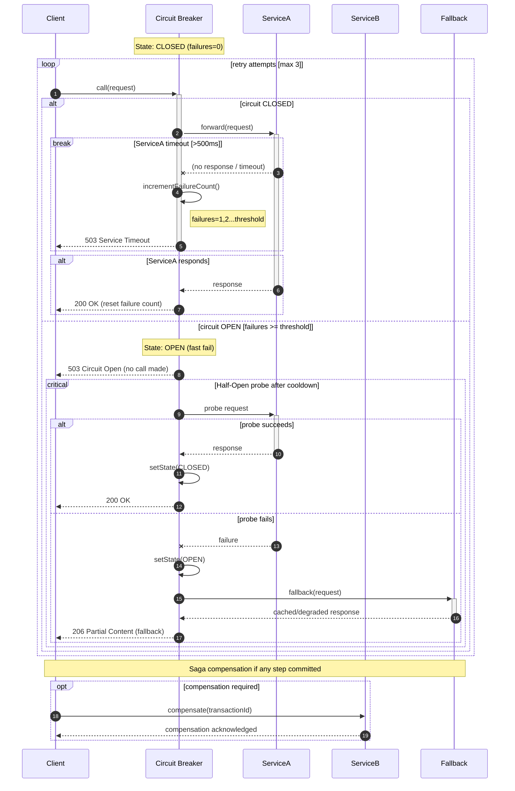
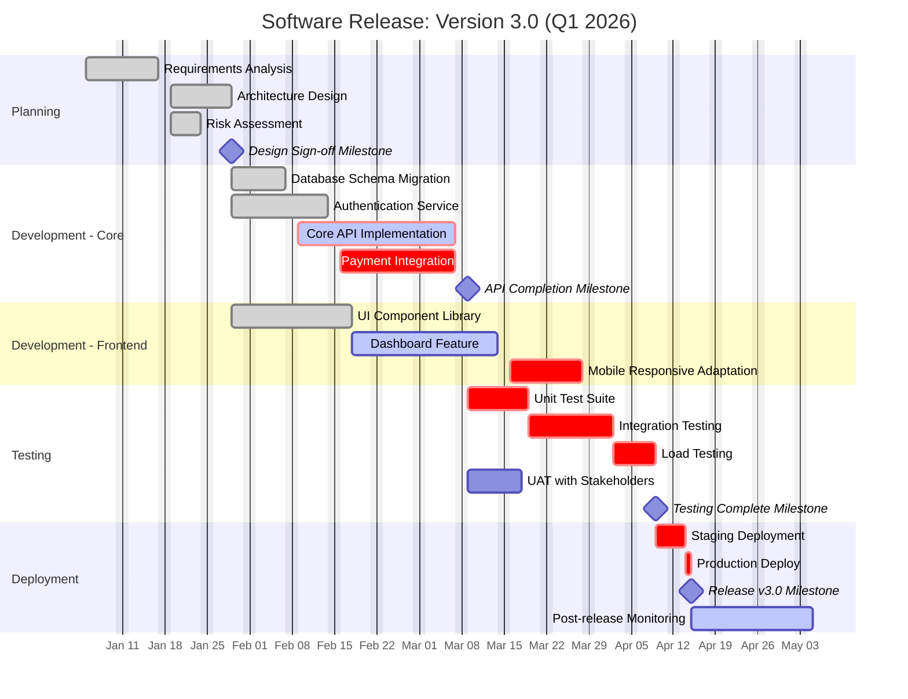
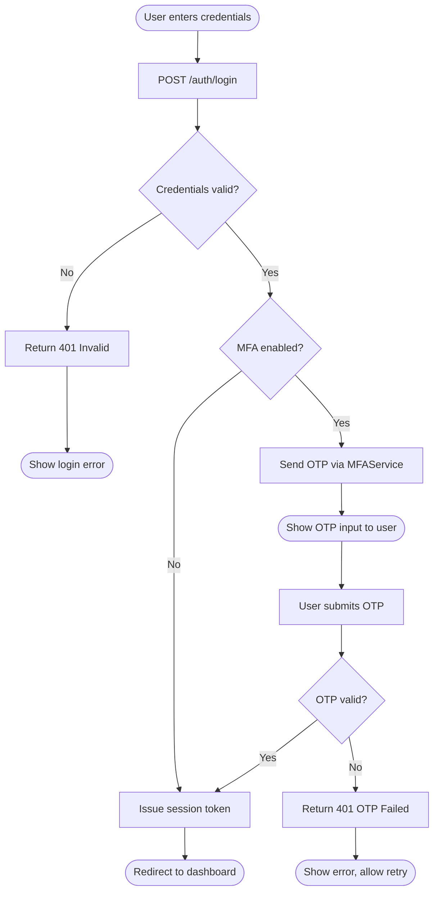

# The Visual Rhetoric of Time in Sequence and Gantt Diagrams: Semiotic Analysis of Temporal Notation Systems

## A PhD Survey Paper

---

## Abstract

This survey examines how temporal ordering, concurrency, and failure are encoded in two dominant software visualization paradigms -- UML 2.x sequence diagrams and Gantt charts -- through the lens of Peircean semiotics, Moody's Physics of Notations, and Blackwell's Cognitive Dimensions of Notations framework. We trace the lineage from Lamport's happens-before relation (1978) through ITU Z.120 Message Sequence Charts, Live Sequence Charts, and the contemporary text-as-diagram language Mermaid. We construct a comparative expressiveness matrix spanning Mermaid, full UML 2.x, BPMN 2.0, and MSC/LSC formalisms across eleven temporal dimensions, and provide exemplary Mermaid diagrams demonstrating all combined fragment types, distributed failure scenarios, critical-path Gantt scheduling, and cross-notation comparison of the same interaction. Open problems identified include: the semantic gap between Mermaid's pragmatic subset and UML's full interaction algebra; the absence of native causal-clock annotation in any widely deployed text-to-diagram system; and the under-theorization of failure-mode semiotics in production distributed systems documentation.

---

## 1. Introduction

The question of how time is made visible in technical diagrams is simultaneously a question of semiotics, cognitive science, and formal semantics. When a software architect draws a vertical dashed line descending from a labeled box, she is not merely decorating a document: she is deploying a sign system with a specific ontology -- the lifeline encodes object existence, the activation box encodes control focus, the horizontal arrow encodes message transmission, and the vertical gap between send and receive events encodes latency. Each choice is loaded with representational consequence.

Two families of temporal diagram dominate software and project engineering practice today. Sequence diagrams -- descended from Lamport diagrams and formalized in UML 2.x via the OMG's interaction diagram framework -- encode partial temporal orderings of inter-object message exchanges. Gantt charts -- descended from Henry Gantt's 1910--1915 bar charts -- encode task duration, parallelism, and dependency as spatial extents on a horizontal time axis. Both have been institutionalized in tooling and culture, yet neither has received systematic semiotic scrutiny commensurate with its epistemic influence.

Mermaid, the text-to-diagram language embedded in GitHub, GitLab, Notion, Confluence, and hundreds of other tools, has made sequence and Gantt diagrams ubiquitous in everyday software documentation. Mermaid's design choices -- which UML constructs to include, which to omit, how to linearize two-dimensional semantics into one-dimensional text -- constitute a set of implicit semiotic decisions with significant consequences for what can and cannot be expressed.

This survey addresses the following research questions:

- RQ1: How do the primitive visual elements of sequence diagrams (lifelines, activation boxes, arrows, frames) function as Peircean signs?
- RQ2: What temporal properties are formally expressible in UML 2.x interaction diagrams, and how does Mermaid's subset compare?
- RQ3: How do Gantt charts encode temporal relations semiotically, and where do they mislead?
- RQ4: How are exceptional flows (timeouts, retries, circuit breakers, sagas) represented across notation systems?
- RQ5: What are the open problems in temporal diagram semiotics?

---

## 2. Theoretical Foundations

### 2.1 Peircean Semiotics Applied to Diagrams

Charles Sanders Peirce's triadic sign theory -- sign vehicle, object, and interpretant -- and his typology of icon, index, and symbol provide the foundational vocabulary for analyzing visual notations. Applied to UML sequence diagrams:

**Icons** (signs that resemble their objects) include:
- The horizontal arrow, which resembles the physical directionality of message transmission
- The vertical dashed lifeline, which spatially mimics the "thread" metaphor of object existence through time
- The activation box width, which loosely mimics the relative "weight" of processing

**Indices** (signs connected to their objects by causality or contiguity) include:
- The arrow's attachment point on a lifeline: the spatial connection to a specific entity is not arbitrary but causally anchors the message to that participant
- The temporal ordering of arrows along the vertical axis: lower position causally implies later occurrence
- The activation box's top and bottom edges, which index the entry and return points of a call frame

**Symbols** (signs connected to objects by convention only) include:
- The solid arrowhead, which by convention means synchronous call
- The open arrowhead, which by convention means asynchronous send
- The dashed return arrow, which by convention means reply
- The combined fragment labels (alt, opt, par, loop) -- purely conventional operator names
- The actor figure (the "stick person"), which by convention means a human principal

This analysis reveals an important asymmetry: the temporal dimension of sequence diagrams is primarily indexical (positions along the vertical axis carry causal meaning), while the inter-participant dimension is primarily symbolic (the meaning of arrowhead styles is conventional). This suggests that the vertical axis should be cognitively "cheaper" to read than the horizontal axis, a hypothesis supported by comprehension studies.

Moody (2009) codifies this intuition in his ninth principle, Cognitive Fit: "the visual representation should match the visual system's capabilities." The vertical time axis in sequence diagrams aligns with the human perception of time as a linear downward flow (consistent with reading direction in Western scripts), while the horizontal axis aligns with spatial separation, exploiting the perceptual primacy of "things being apart from each other."

### 2.2 Moody's Physics of Notations (2009)

Moody's nine principles for designing cognitively effective visual notations are directly applicable to evaluating sequence and Gantt diagram notations:

1. **Semiotic Clarity**: Each concept should be mapped to exactly one visual symbol. UML 2.x violates this partially -- the term "interaction fragment" covers both single messages and complex combined fragments under one visual frame construct.

2. **Perceptual Discriminability**: Symbols should be perceptually distinct. Mermaid's sequence diagram syntax uses arrow variants (--, ->>, -->>>) that are visually similar but semantically distinct, creating discriminability risk.

3. **Semantic Transparency**: Symbol appearance should suggest meaning. The Gantt bar's horizontal extent transparently encodes duration (an icon). The combined fragment's rectangular frame is less transparent -- there is no visual reason why a rectangle should mean "conditional execution."

4. **Complexity Management**: Notations should provide mechanisms for hiding detail. Mermaid's `ref` fragment (interaction references) partially addresses this, but lacks UML's full `InteractionUse` with parameter substitution.

5. **Cognitive Integration**: Diagrams should support integration of related information. The Gantt chart's horizontal time axis directly integrates all tasks into a shared temporal reference frame, enabling immediate parallel reading. Sequence diagrams' local ordering makes global time reconstruction cognitively expensive.

6. **Visual Expressiveness**: Notations should use the full range of visual variables (position, size, shape, color, texture). Gantt charts exploit color for status (done, active, critical), but sequence diagrams use almost no color in standard UML -- a missed expressiveness opportunity that Mermaid partially corrects with `rect` background highlighting.

7. **Dual Coding**: Combining text and graphics reinforces understanding. Both sequence and Gantt diagrams achieve this -- labels co-occur with graphical structure.

8. **Graphic Economy**: Minimize the number of symbols. UML 2.x has accumulated excessive symbols through successive specification versions; Mermaid's design explicitly trades expressiveness for economy.

9. **Cognitive Fit**: Match notation to task type. Sequence diagrams fit inter-object protocol analysis; Gantt charts fit duration-and-dependency planning. Neither fits the other's task well, which is a key finding of this survey.

### 2.3 Blackwell's Cognitive Dimensions of Notations

The Cognitive Dimensions of Notations (CDN) framework, developed by Green and Blackwell across several publications from 1989 to 2003, provides a vocabulary of thirteen dimensions for evaluating any notation. The most relevant for temporal diagrams are:

- **Closeness of Mapping**: How directly does the notation map to the domain? Sequence diagrams have high closeness of mapping for protocol analysis (the diagram literally looks like what is happening), but Gantt charts have lower closeness for tasks with uncertain duration, since bars imply precision that may not exist.

- **Viscosity**: Resistance to change. Text-based diagrams (Mermaid, PlantUML) have lower viscosity than graphical tools -- inserting a new participant requires one line of text, not redrawing the entire layout.

- **Diffuseness**: Verbosity. Full UML has high diffuseness compared to Mermaid. The `seq` (weak sequencing) operator in UML requires a full combined fragment frame with label; Mermaid has no equivalent construct, reducing diffuseness at the cost of expressiveness.

- **Hidden Dependencies**: Dependencies not visible in the notation. Mermaid Gantt's `after` keyword makes dependencies explicit (low hidden dependency). Standard UML sequence diagrams have high hidden dependency: the fact that a lifeline only appears when created by a `create` message is not always visually obvious.

- **Error-Proneness**: How likely is the notation to cause errors? The UML 2.x specification's informal semantics for combined fragments is notoriously error-prone; different tools implement `par` fragments differently.

---

## 3. UML 2.x Sequence Diagram Formal Semantics

### 3.1 Foundational Model: Traces and Partial Orders

The formal basis of UML 2.x sequence diagrams, as analyzed in depth by Micskei and Waeselynck (2011) in their survey "The many meanings of UML 2 Sequence Diagrams," is a trace semantics over partially ordered event sets. An interaction is a set of lifelines and a set of messages; the semantics assigns to each interaction a set of valid traces (sequences of events) and optionally a set of invalid traces.

The key insight is that UML's OMG specification defines trace validity and invalidity as the two axes of a three-valued logic: some traces are explicitly valid, some explicitly invalid, and the remaining form an "inconclusive" region. This three-valued structure is not a flaw but a design feature -- it allows sequence diagrams to specify partial behavioral contracts without over-constraining implementation.

Lifelines (formally called `Lifeline` objects in the UML 2.5.1 metamodel) encode the existence of a participant through time. A lifeline may be created (via a `create` message with a filled arrowhead pointing to the lifeline header box) or destroyed (via a `destroy` message with an X at the lifeline terminus). Between creation and destruction, the lifeline's dashed vertical line encodes potential liveness -- the participant exists but may be idle.

Execution specifications (informally "activation boxes") encode `OccurrenceSpecification` pairs: a `startEvent` and a `finishEvent`. The bar's spatial extent is indexical: it encodes the temporal interval during which the lifeline is executing a unit of behavior.

### 3.2 The Combined Fragment Taxonomy

The UML 2.x combined fragment operands and their formal trace-set semantics are:

| Operator | Formal Semantics | Visual Encoding | Temporal Meaning |
|----------|-----------------|-----------------|-----------------|
| `alt` | Nondeterministic choice over operands | Frame with guard conditions | At most one operand's traces are valid for any execution |
| `opt` | Optional execution of single operand | Frame with guard condition | Zero or one occurrence of the operand's traces |
| `break` | Operand replaces enclosing fragment on condition | Frame with guard | Escape from normal flow; remaining enclosing operand is not executed |
| `par` | Parallel interleaving of operands | Frame with horizontal dividers | All interleavings of operand traces are valid |
| `seq` | Weak sequencing | Frame | Operands execute in order, but messages on distinct lifelines may interleave |
| `strict` | Strict sequencing | Frame | Operands execute in strict order with no interleaving |
| `loop` | Iteration with optional guard | Frame with guard | Operand traces may repeat, with bounds |
| `critical` | Critical region | Frame | No interleaving with other threads; atomic execution |
| `neg` | Negative traces | Frame | Enclosed traces are explicitly invalid |
| `ignore` / `consider` | Scoping filter | Frame | Specifies which message types are significant |
| `assert` | Mandatory occurrence | Frame | Enclosed traces must occur |
| `ref` | Interaction reference | Frame | Substitutes a named interaction definition |

### 3.3 Message Taxonomy in UML 2.x

| Message Type | Visual Syntax | Temporal Semantics |
|-------------|--------------|-------------------|
| Synchronous call | Solid filled arrowhead | Sender blocks until reply received |
| Asynchronous send | Open arrowhead | Sender continues after send event |
| Reply | Dashed line with open arrowhead | Return from a synchronous call |
| Create | Dashed line to lifeline header | Creates participant; lifeline begins |
| Destroy | Filled arrowhead to X terminus | Destroys participant; lifeline ends |
| Lost message | Arrow to filled circle | Message sent but never received |
| Found message | Filled circle to arrow origin | Message received with unknown origin |

Lost and found messages are UML 2.x features that have no equivalent in Mermaid, representing a significant expressiveness gap for distributed systems modeling where message loss is a first-class concern.

---

## 4. Mermaid Sequence Diagram: Capabilities and Expressiveness

### 4.1 Participant and Actor Declarations

Mermaid distinguishes between `participant` (rendered as a rectangle) and `actor` (rendered as a stick figure). Both support aliases. The `create` and `destroy` keywords (added in later Mermaid versions) partially implement UML's participant lifecycle, though without the full lifeline-X termination visual.

Participant ordering is significant: Mermaid renders participants in declaration order, which must be manually managed. UML tools typically infer ordering from first appearance.

### 4.2 Message Arrow Taxonomy

Mermaid supports six arrow variants:

| Syntax | Visual | Semantic Meaning |
|--------|--------|----------------|
| `A->B` | Solid open arrow | Synchronous, no arrowhead filled |
| `A-->B` | Dotted open arrow | Return / reply |
| `A->>B` | Solid filled arrowhead | Synchronous call (most common) |
| `A-->>B` | Dotted filled arrowhead | Asynchronous reply |
| `A-)B` | Solid half-open arrow | Async message |
| `A--)B` | Dotted half-open arrow | Async reply |
| `A-xB` | Solid with X at end | Lost message (participant termination) |
| `A--xB` | Dotted with X at end | Lost message reply |

### 4.3 Combined Fragment Support

Mermaid implements seven of UML's twelve interaction operators:

| UML Operator | Mermaid Support | Syntax |
|-------------|-----------------|--------|
| `alt` | Full | `alt [guard]` / `else` / `end` |
| `opt` | Full | `opt [guard]` / `end` |
| `par` | Full | `par` / `and` / `end` |
| `critical` | Full | `critical` / `option [label]` / `end` |
| `break` | Full | `break [guard]` / `end` |
| `loop` | Full | `loop [guard]` / `end` |
| `rect` | Partial (visual only) | `rect [color]` / `end` (no semantic label) |
| `seq` | Absent | No equivalent |
| `strict` | Absent | No equivalent |
| `neg` | Absent | No equivalent |
| `ignore/consider` | Absent | No equivalent |
| `assert` | Absent | No equivalent |
| `ref` | Absent | No equivalent |

The `rect` construct in Mermaid deserves special note: it provides a colored background region but carries no formal semantic operator label, making it purely a visual grouping device. This illustrates Mermaid's design philosophy of pragmatic legibility over semantic completeness.

### 4.4 Additional Mermaid Features

- **`autonumber`**: Adds sequential integers to messages, encoding explicit ordering as a symbolic index
- **Notes**: `Note right of A: text`, `Note over A,B: text` -- one-directional commentary annotations
- **Links**: URL hyperlinking from participants to external resources (wiki pages, dashboards)
- **`activate`/`deactivate`**: Explicit activation box management, or via `+`/`-` suffix on arrows
- **Actor creation/destruction**: `create participant B` and `destroy B` with `A->>+B` / `A-xB` syntax

---

## 5. Temporal Logic and Visual Representation

### 5.1 Lamport's Happens-Before and Sequence Diagrams

Lamport's 1978 paper "Time, Clocks, and the Ordering of Events in a Distributed System" (Communications of the ACM 21:7, 558--565) defines the `→` happens-before relation: event `a` happens before event `b` (`a → b`) if either (1) `a` and `b` are events in the same process and `a` comes before `b`, or (2) `a` is the sending and `b` is the receiving of the same message.

A sequence diagram is precisely a graphical encoding of happens-before. The vertical axis maps to process-local ordering (case 1), and arrows map to message send-receive pairs (case 2). Events whose vertical positions cannot be related by the happens-before relation are concurrent -- they occupy incomparable positions in the partial order.

This encoding has a fundamental limitation: it represents one execution scenario, not the full behavioral space. A single sequence diagram corresponds to one (or finitely many, for branching fragments) trace through the system's state space. The behavioral specification is therefore underspecified by any single diagram.

### 5.2 Vector Clocks and the Visualization Gap

Mattern (1988) and Fidge (1988) independently introduced vector clocks as a mechanism for capturing the complete set of causally consistent orderings in a distributed computation. A vector clock assigns each process `i` a vector `V_i` where `V_i[j]` counts the number of events at process `j` known to process `i`.

The critical observation for diagram semiotics is that vector clocks carry strictly more temporal information than sequence diagrams can encode. A sequence diagram captures the partial order of events but does not annotate events with their causal histories. To visualize vector clock information, one would need to annotate each message arrow with a vector, transforming the diagram from an icon of process behavior into a symbol-heavy formal notation -- at significant cognitive cost.

Recent work (arxiv:2311.07535, "Causality Diagrams using Hybrid Vector Clocks," 2023) explores combining Lamport-style visual diagrams with vector clock annotations, but no mainstream diagram tool has adopted this approach.

### 5.3 Message Sequence Charts and Their Formal Properties

The ITU-T Z.120 Message Sequence Chart standard (first published 1992, most recent revision 2011) predates and partially inspired UML sequence diagrams. MSC defines:

- **Basic MSC (bMSC)**: A single scenario with linear per-process ordering and message-induced inter-process ordering -- a direct encoding of happens-before
- **High-level MSC (hMSC)**: A directed graph (with possible cycles) over bMSCs, encoding a set of possible scenarios as a regular language over the bMSC alphabet
- **Data extensions**: Variables, conditions, and timers

MSC's formal properties are well-studied. Key results include:
- The set of behaviors expressible by hMSCs is not closed under intersection (non-closure property)
- Checking whether a distributed system implementation satisfies an MSC specification is undecidable in general
- Restricted classes of MSCs (e.g., "locally synchronized" or "communicating automata" models) recover decidability

### 5.4 Live Sequence Charts: From Scenarios to Properties

Damm and Harel's LSC formalism (2001, "LSCs: Breathing Life into Message Sequence Charts") extends MSC by introducing two crucial modal distinctions:

- **Universal LSC**: A chart that must be satisfied whenever its prechart is observed (obligatory behavior)
- **Existential LSC**: A chart that describes a possible but not required scenario

This distinction maps onto temporal logic modalities. The key result (Harel et al., 2004, "Temporal Logic for Scenario-Based Specifications") is that:

- Existential LSCs can be encoded in CTL (Computation Tree Logic)
- Universal LSCs lie in LTL ∩ CTL -- expressible in both linear and branching temporal logic
- The full LSC language corresponds to a strict subset of CTL*

This theoretical connection establishes that sequence-style diagrams, when augmented with modal annotations, can serve as visual front-ends to temporal logic specification systems. The play-in/play-out methodology (Harel and Marelly, 2003) allows LSC specifications to be directly executed as behavioral controllers.

### 5.5 TLA+ and the Temporal Logic of Actions

Lamport's TLA+ (Temporal Logic of Actions, developed from the early 1990s) represents the opposite pole from visual sequence diagrams. TLA+ specifications use:

- Set theory for state descriptions
- The `□` (always) and `◇` (eventually) operators from LTL for liveness properties
- The `UNCHANGED` predicate for stuttering-invariance

TLA+ is not a visual notation but a textual one, and its temporal operators have no direct visual counterpart in sequence diagrams. The absence of a visual notation for liveness properties (things that must eventually happen) is a significant gap: sequence diagrams can show that a message eventually arrives in a specific scenario, but cannot express the universal property that "every request will eventually receive a response."

---

## 6. Notation Comparison: BPMN vs. UML vs. Mermaid

### 6.1 Temporal Expressiveness Matrix

The following matrix rates each notation on eleven temporal dimensions using a three-value scale: Full (F), Partial (P), Absent (A).

| Temporal Dimension | Full UML 2.x | Mermaid Seq | BPMN 2.0 | MSC/LSC |
|-------------------|-------------|------------|---------|--------|
| Linear ordering of events | F | F | F | F |
| Partial ordering / concurrency | F (`par`) | F (`par`) | F (parallel gateway) | F |
| Strict temporal sequencing | F (`strict`) | A | P (sequence flow) | P |
| Weak sequencing | F (`seq`) | A | A | P |
| Conditional branching | F (`alt`) | F (`alt`) | F (exclusive gateway) | P |
| Optional behavior | F (`opt`) | F (`opt`) | F (conditional flow) | F |
| Iteration / looping | F (`loop`) | F (`loop`) | F (loop task) | P |
| Time durations | P (constraints) | A | F (timer events) | P (timed MSC) |
| Absolute timestamps | P (constraints) | A | F (ISO 8601 in timers) | P |
| Timeout modeling | P (`break` + timer) | P (`break`) | F (timer boundary event) | P |
| Liveness / eventual properties | A | A | P (SLAs in extensions) | F (universal LSC) |
| Negative / forbidden traces | F (`neg`) | A | A | A |
| Message loss modeling | F (lost/found) | P (arrow-x) | A | P |
| Compensating transactions | A | A | F (compensation events) | A |
| Critical region / mutex | F (`critical`) | F (`critical`) | A | A |
| Causal annotation | A | A | A | A |
| Cross-diagram reference | F (`ref`) | A | F (call activity) | F |

This matrix makes the expressiveness ordering clear: MSC/LSC > Full UML 2.x > BPMN 2.0 > Mermaid for purely temporal reasoning. However, BPMN 2.0 exceeds UML 2.x and Mermaid for real-time / calendar-time specification due to its native ISO 8601 timer event support.

### 6.2 BPMN's Distinct Temporal Competencies

BPMN 2.0 timer events deserve detailed treatment because they represent a genuinely different approach to temporality. While sequence diagrams encode event ordering (partial order semantics), BPMN timer events encode:

- **Time Date**: An absolute ISO 8601 timestamp (e.g., `2026-03-16T09:00:00Z`) at which a flow proceeds
- **Time Duration**: An ISO 8601 duration (e.g., `PT30M` for 30 minutes) after which a flow times out
- **Time Cycle**: A recurrence pattern (e.g., `R3/PT1H` for three repetitions every hour)

These are clock-time expressions, not logical-time expressions. A UML sequence diagram with timing constraints (`{t1..t2}` annotations on message arrows) can approximate this, but the notation is informal and tool support is inconsistent.

---

## 7. Gantt Chart Semiotics

### 7.1 Historical Semiosis: From Adamiecki to Digital Gantt

Henry Gantt's 1910--1915 bar charts (published in "Work, Wages, and Profit," 1916, and "Organizing for Work," 1919) were designed for industrial production scheduling, not software development. The original charts lacked dependency arrows -- tasks were independent activities whose only relationship was temporal coincidence on a shared time axis.

It is worth noting that Karol Adamiecki developed a similar "harmonogram" in 1896, 14 years before Gantt, but published primarily in Polish, limiting his Western influence. The semiotic choices embedded in what we call a "Gantt chart" are therefore partly accidents of history rather than deliberate optimal design.

### 7.2 Semiotic Anatomy of the Gantt Bar

The Gantt chart deploys a richer but less studied sign system than the sequence diagram. Its primitive elements and their semiotic functions:

**The horizontal time axis**: A direct icon of linear clock time, with spatial extent directly proportional to calendar duration. This is one of the most transparent iconic encodings in technical visualization -- no training is needed to understand that a longer bar means more time.

**The task bar**: An icon of task duration (length) and position in time (left edge = start, right edge = end). The bar's thickness (height) is semantically null -- it encodes nothing about the task, only serving as a perceptual affordance (something to see).

**The section / row label**: A symbol -- purely conventional identification of a task by name.

**The dependency arrow**: An index -- a causal connection between two tasks that must be read sequentially. The arrow directs attention from predecessor to successor, encoding a partial order constraint. In full critical path method (CPM) notation, these arrows can encode four relationship types: Finish-to-Start (FS), Start-to-Start (SS), Finish-to-Finish (FF), and Start-to-Finish (SF). Mermaid's Gantt only supports FS via the `after` keyword.

**Milestone diamonds**: Temporal points (zero duration). The diamond shape is iconic of a point versus a duration, but this iconicity is weak -- the diamond convention is culturally learned.

**Color coding**: Symbolic in standard Gantt charts (color meaning is legend-dependent), though red for "critical" tasks exploits a cultural icon (red = danger/urgency).

### 7.3 Cognitive Effectiveness of Gantt Charts

Research findings from project management literature reveal a complex cognitive picture:

**Strengths**:
- Gantt charts are "easily interpreted without training" (Wadhwa, 2024) for basic duration and sequence reading
- The horizontal time axis enables immediate visual comparison of task lengths and overlaps
- Color-coded status (done, active, behind schedule) provides rapid situation awareness
- The shared time axis creates a "temporal common ground" among stakeholders with different domain expertise

**Limitations**:
- "Examining a Gantt chart as a single snapshot limits ability to understand the dynamic nature of the schedule and visualize how activity float is consumed throughout a project" (from project management research)
- "Linked Gantt charts quickly become cluttered in all but the simplest cases" -- dependency arrows degrade into visual noise at scale
- "Critical path network diagrams are superior to visually communicate the relationships between tasks" -- when dependencies matter more than duration, the wrong notation is typically chosen
- Gantt bars encode planned duration with iconic precision but the precision is illusory for tasks with high uncertainty -- the bar's sharp edges imply a knowledge of start and end dates that does not exist
- Gantt charts have no notation for task uncertainty, risk, or probability distributions -- an "optimistic/pessimistic" range bar is available in some tools but not standardized

The research literature specifically indicts "Gantt's widespread adoption is perhaps less based on its universal application and suitability as perhaps the absence of any alternative." This is a damning semiotic indictment: the notation achieved dominance through default, not through demonstrated cognitive superiority.

### 7.4 Mermaid Gantt: Features and Limitations

Mermaid's Gantt implementation supports:

**Task declaration syntax**:
```
section Phase Name
    Task name   : [modifiers,] [id,] startDate, duration
```

**Task type modifiers**:
- `done`: Task is complete (visual: different fill color)
- `active`: Task is in progress (visual: highlighted fill)
- `crit`: Task is on the critical path (visual: red fill)
- `milestone`: Zero-duration point event (visual: diamond)

**Dependencies**:
- `after taskId`: Task starts when `taskId` completes (Finish-to-Start only)
- `until taskId`: Task runs until another task begins (added v10.9.0)

**Date and time control**:
- `dateFormat YYYY-MM-DD`: Input format
- `axisFormat %m/%d`: Display format
- `tickInterval 1week`: Grid spacing

**Exclusions**:
- `excludes weekends`: Excludes Saturday and Sunday
- `excludes YYYY-MM-DD`: Excludes specific dates
- Excluded days extend task duration to maintain specified working-day count

**Compact mode**: Multiple tasks on the same row to reduce vertical space

**Vertical markers** (`vert`): Date-anchored vertical lines for deadlines or events

**Missing from Mermaid Gantt**:
- SS, FF, SF dependency types
- Resource allocation views
- Baseline comparison (planned vs. actual)
- Percent completion (only binary done/active)
- Calendar-aware scheduling (holidays, custom work patterns)
- Risk / uncertainty intervals
- Cost tracking

---

## 8. Failure Mode Representation in Distributed Systems

### 8.1 The Notation Gap for Exceptional Flows

Distributed systems design has produced a rich vocabulary of failure-handling patterns: timeout, retry with exponential backoff, circuit breaker (with Closed/Open/Half-Open states), bulkhead isolation, fallback, hedged requests, and compensating transactions (the saga pattern). Yet the notation systems available to engineers for documenting these patterns have evolved much more slowly.

The fundamental challenge is that failure modes introduce non-determinism and time-dependency that standard sequence diagram syntax was not designed to express cleanly. A timeout is a condition on the duration of a wait -- exactly the kind of absolute-clock information that sequence diagrams lack. A circuit breaker is a stateful component with three possible modes -- a state machine layered on top of the interaction protocol.

### 8.2 Encoding Failure Patterns in UML 2.x

UML 2.x provides several mechanisms for failure encoding, though all require creative interpretation:

**Timeout**: Use a `break` fragment with guard `[timeout after T]` on a synchronous call. The `break` operator means "if the guard is true, execute this operand and skip the remaining enclosing interaction." Combined with a `loop` for retry:

```
loop [attempt < MAX_RETRIES]
    break [response received]
        Client ->> Service : request
        Service -->> Client : response
    break [timeout after 500ms]
        Service --x Client : (no response)
        Client -> Client : increment attempt
end
```

**Circuit breaker**: Requires an `alt` with guards referencing the circuit breaker's state, which is itself typically rendered in a separate state machine diagram. The interaction diagram can only show one circuit state at a time.

**Saga compensation**: The most common approach is to show the forward transaction in one sequence diagram and the compensation flow in a separate diagram with a `ref` to the compensation interaction. UML 2.x has no native notation for "undo" or "compensate."

### 8.3 Encoding in Mermaid

Mermaid's `break` and `alt` operators, combined with `loop`, cover most timeout and retry patterns expressible in text. The `critical` block can encode atomic operations. However:

- No native timeout-duration annotation on arrows
- No circuit breaker state machine integration
- No compensation/undo notation
- The `break` operator's UML semantics (escaping from the enclosing fragment) is not fully implemented in all Mermaid rendering contexts

---

## 9. Exemplary Mermaid Diagrams

### 9.1 Sequence Diagram: All Combined Fragment Types

The following diagram demonstrates all six Mermaid-supported combined fragment types in a realistic distributed service interaction, plus activation boxes and `autonumber`.

```mermaid
sequenceDiagram
    autonumber
    participant Client
    participant Gateway
    participant AuthService
    participant DataService
    participant Cache

    Client->>+Gateway: POST /api/resource (token)
    Gateway->>+AuthService: validateToken(token)

    alt token valid
        AuthService-->>-Gateway: {userId, roles}
        Gateway->>+Cache: GET resource:123
        critical Ensure cache atomicity
            Cache-->>Gateway: MISS
            Gateway->>+DataService: fetchResource(123)
            DataService-->>-Gateway: {data}
            Gateway->>Cache: SET resource:123 TTL=300
        end

        opt user has premium role
            Gateway->>DataService: fetchEnrichedMetadata(123)
            DataService-->>Gateway: {enrichedData}
        end

        par Async telemetry
            Gateway-)Client: SSE: processing_started
        and Async audit log
            Gateway-)AuthService: logAccess(userId, resource:123)
        end

        Gateway-->>-Client: 200 OK {data}

    else token invalid
        AuthService-->>-Gateway: 401 Unauthorized
        Gateway-->>Client: 401 Unauthorized

        break request processing halted
            Gateway-)Client: event: auth_failure
        end
    end

    loop every 30s until acknowledged
        Gateway-)Client: SSE: keepalive
    end
```

### 9.2 Sequence Diagram: Distributed Failure Scenario (Timeout, Retry, Circuit Breaker)



### 9.3 Gantt Chart: Critical Path, Milestones, and Dependencies



### 9.4 Cross-Notation Comparison: Same Interaction in Sequence vs. Flowchart Style

The following pair demonstrates the same "user login with MFA" interaction expressed first as a Mermaid sequence diagram (encoding temporal ordering and inter-party message flow) and then as a Mermaid flowchart (encoding control flow and decision logic without temporal multi-party structure).

**Sequence Diagram (temporal, multi-party, message-centric)**:

```mermaid
sequenceDiagram
    autonumber
    actor User
    participant Browser
    participant AuthAPI
    participant MFAService
    participant UserDB

    User->>+Browser: enter credentials
    Browser->>+AuthAPI: POST /auth/login {email, password}
    AuthAPI->>+UserDB: lookupUser(email)
    UserDB-->>-AuthAPI: {userId, hashedPassword, mfaEnabled}

    alt credentials valid
        alt MFA enabled
            AuthAPI->>+MFAService: sendOTP(userId, channel)
            MFAService-->>-AuthAPI: otpSent=true
            AuthAPI-->>Browser: 202 MFA Required {challengeId}
            Browser-->>User: show OTP input
            User->>Browser: enter OTP
            Browser->>AuthAPI: POST /auth/mfa {challengeId, otp}
            AuthAPI->>MFAService: verifyOTP(challengeId, otp)

            alt OTP valid
                MFAService-->>AuthAPI: valid=true
                AuthAPI-->>Browser: 200 OK {sessionToken}
                Browser-->>-User: redirect to dashboard
            else OTP invalid or expired
                MFAService-->>AuthAPI: valid=false
                AuthAPI-->>-Browser: 401 OTP Failed
                Browser-->>User: show error, allow retry
            end

        else MFA not enabled
            AuthAPI-->>-Browser: 200 OK {sessionToken}
            Browser-->>-User: redirect to dashboard
        end

    else credentials invalid
        AuthAPI-->>-Browser: 401 Invalid Credentials
        Browser-->>-User: show login error
    end
```

**Flowchart (control flow, process-centric, no temporal axis)**:



The contrast is instructive. The sequence diagram encodes:
- Which actor sends each message (spatial separation of swimlanes)
- The temporal ordering of all messages (vertical axis)
- Network round-trips as visual cross-cuts of space
- Concurrent waiting states (User waits while Browser waits while AuthAPI processes)

The flowchart encodes:
- Decision logic and branching structure
- The overall process shape as a directed graph
- Neither temporal ordering nor multi-party message ownership

Neither is superior in the abstract -- their semiotic strengths are complementary. The sequence diagram is superior for protocol analysis and implementation guidance; the flowchart is superior for business process documentation and onboarding non-technical stakeholders.

---

## 10. Taxonomy of Temporal Encoding Approaches

### Dimension 1: Time Model

| Notation | Time Model | Characteristics |
|---------|-----------|----------------|
| Sequence diagram | Partial order (event-based) | Lamport happens-before; no wall-clock |
| Gantt chart | Total order (calendar-based) | Wall-clock time; duration as distance |
| MSC/LSC | Partial order + modalities | Happens-before + universal/existential |
| BPMN with timers | Mixed | Partial order + ISO 8601 durations |
| TLA+ | State-transition + LTL | Stuttering-invariant; temporal operators |

### Dimension 2: Concurrency Representation

| Notation | Concurrency Model |
|---------|-----------------|
| Sequence diagram (`par`) | Arbitrary interleaving of event sequences |
| Gantt chart | Parallel bars with optional dependency arrows |
| BPMN (parallel gateway) | Token-based synchronization |
| MSC | Process-local ordering + message-induced constraints |
| Petri nets | Firing rules over marking states |

### Dimension 3: Failure Expressiveness

| Pattern | Sequence Diag. | Gantt | BPMN | Mermaid |
|---------|---------------|-------|------|---------|
| Timeout | `break` | None | Timer boundary event | `break` |
| Retry | `loop` + `break` | None | Loopback arc | `loop` + `break` |
| Circuit breaker | `alt` (manual state) | None | None | `alt` |
| Saga / compensation | Separate ref diagram | None | Compensation events | None |
| Partial failure | `alt` with `neg` | None | Error boundary event | `alt` |

---

## 11. Open Problems

### 11.1 The Causal Clock Annotation Gap

No widely deployed text-to-diagram language -- including Mermaid, PlantUML, or D2 -- supports annotating messages with vector clock or hybrid logical clock values. This means that engineers documenting distributed system behavior cannot express causal relationships beyond the simplistic total order implied by vertical position. As distributed systems grow in complexity (geo-replicated stores, eventual consistency, CRDT-based synchronization), this gap will widen.

**Research opportunity**: Design a notation extension that annotates arrows with causal timestamps, and conduct comprehension studies to measure the cognitive cost of this added expressiveness.

### 11.2 Mermaid's Semantic Incompleteness

Mermaid's absence of `seq`, `strict`, `neg`, `assert`, `ignore`, `consider`, and `ref` operators means that Mermaid diagrams are always behavioral scenarios (examples of possible behavior), never behavioral specifications (contracts about required behavior). This is adequate for documentation but inadequate for formal verification.

**Research opportunity**: Design a "Mermaid+ Spec" extension that adds the five most formally significant missing operators (`neg`, `assert`, `strict`, `ref`, `consider`) with syntax designed to preserve Mermaid's text-legibility philosophy.

### 11.3 Gantt Chart Uncertainty Representation

Gantt bars encode planned duration with a precision that is almost always false. There is no standardized notation for task uncertainty -- whether probabilistic (distribution over duration) or scenario-based (optimistic/expected/pessimistic). Monte Carlo scheduling tools generate internal distributions but display only expected-value Gantt bars to users.

**Research opportunity**: Develop and empirically evaluate interval-bar Gantt notation (where bars show a range, not a point estimate) and measure its effect on planning accuracy and stakeholder alignment.

### 11.4 Failure-Mode Semiotics as a First-Class Design Problem

The field lacks a systematic semiotic vocabulary for exceptional flows. The circuit breaker pattern, for example, has a well-known state machine (Closed/Open/Half-Open) that does not map cleanly onto any standard interaction diagram construct. Engineers today must choose between: (a) an inaccurate but readable `alt` block, (b) a separate state machine diagram with a `ref` reference, or (c) a prose annotation.

**Research opportunity**: Develop a "Distributed Resilience Notation" (DRN) as a Mermaid extension or standalone mini-language specifically for circuit breakers, retry policies, timeout cascades, and saga compensation flows.

### 11.5 Empirical Validation Deficit

The field is largely theoretical. Moody's Physics of Notations synthesizes existing cognitive science rather than generating new empirical data specific to software diagrams. Studies comparing comprehension rates across Mermaid, full UML, and BPMN for the same system description would provide actionable evidence for notation design choices.

**Research opportunity**: Conduct a controlled experiment with professional software engineers (n >= 100) comparing task performance (answer correctness, time, confidence) across sequence diagram, flowchart, and Mermaid renderings of the same distributed system interaction.

---

## 12. Comparative Synthesis

The central finding of this survey is a productivity/expressiveness trade-off that runs through the entire history of temporal diagram notation:

- **Maximum expressiveness** (LSC, full UML 2.x with all operators) requires training investment that limits adoption and creates diagram complexity that exceeds most engineers' working memory capacity
- **Maximum adoptability** (Mermaid, early Gantt charts) sacrifices the formal properties needed for specification and verification, leaving the diagrams as illustrations rather than contracts
- **The middle ground** (BPMN 2.0, MSC without HMSCs) achieves reasonable adoption among specialized practitioners (business analysts, protocol engineers) but requires domain-specific tooling

The semiotic analysis reveals that this trade-off is not accidental: it reflects the fundamental tension between iconic transparency (meaning should be self-evident) and formal completeness (all semantically distinct situations should have distinct representations). UML's `neg` operator is formally important but semiotically opaque -- there is no visual intuition for "this interaction is forbidden." Mermaid's designers correctly identified this opacity and excluded `neg` from the language; the cost is that Mermaid diagrams cannot express negative requirements.

The Gantt chart occupies a unique semiotic position: it achieves the highest iconic transparency of any temporal notation (bars are time, trivially) while providing the weakest formal semantics (no notion of message exchange, no concurrency model, no failure modes). Its dominance is precisely a result of its semiotic simplicity -- and that simplicity is both its greatest cognitive virtue and its most dangerous limitation.

---

## 13. Conclusion

This survey has traced temporal notation systems from Lamport's 1978 foundational paper through UML 2.x's twelve interaction operators, MSC/LSC's modal extensions, and Mermaid's pragmatic subset, analyzing each through Peircean semiotics, Moody's Physics of Notations, and Blackwell's Cognitive Dimensions framework.

The key conclusions are:

1. Sequence diagrams are primarily indexical in their temporal dimension: vertical position encodes causal precedence through spatial convention that is consistent with human temporal perception. This makes them cognitively efficient for their primary task -- protocol analysis -- and inefficient for other tasks.

2. Mermaid's sequence diagram implements a pragmatically selected subset of UML 2.x operators that covers the most common documentation needs (alt, opt, par, loop, break, critical) while omitting the formal specification operators (neg, assert, ref, strict, seq) that are necessary for behavioral verification.

3. Gantt charts exploit iconic transparency (bar length = duration) to achieve near-zero training cost, but this iconic simplicity conceals fundamental limitations: no message semantics, no failure modes, no uncertainty representation, and misleading precision.

4. BPMN 2.0 occupies a unique expressiveness niche: its timer events provide genuine calendar-time specification capability that neither UML 2.x sequence diagrams nor Mermaid can match, making it the most powerful notation for time-sensitive business process modeling.

5. The frontier of temporal notation research lies at the intersection of causal consistency theory (vector clocks, hybrid logical clocks) and visual diagram design -- an intersection that no mainstream tool has yet exploited.

For practitioners, the recommendation is clear: use Mermaid sequence diagrams for protocol documentation, use Mermaid Gantt for schedule communication, use full UML 2.x (in tools like Enterprise Architect or Papyrus) when behavioral specification is the goal, and use BPMN 2.0 when calendar-time constraints are primary. No single notation serves all temporal reasoning needs, and the first step in effective diagramming is understanding which aspects of time one is actually trying to encode.

---

## 14. References

### Foundational Theory

1. Peirce, C.S. (1931--1958). *Collected Papers of Charles Sanders Peirce*. Harvard University Press. (Volumes I--VIII)

2. Lamport, L. (1978). Time, Clocks, and the Ordering of Events in a Distributed System. *Communications of the ACM*, 21(7), 558--565. Retrieved from [https://lamport.azurewebsites.net/pubs/time-clocks.pdf](https://lamport.azurewebsites.net/pubs/time-clocks.pdf)

3. Moody, D.L. (2009). The "Physics" of Notations: Toward a Scientific Basis for Constructing Visual Notations in Software Engineering. *IEEE Transactions on Software Engineering*, 35(6), 756--779. DOI: 10.1109/TSE.2009.67. Available: [IEEE Xplore](https://ieeexplore.ieee.org/document/5353439/) / [Semantic Scholar](https://www.semanticscholar.org/paper/The-%E2%80%9CPhysics%E2%80%9D-of-Notations:-Toward-a-Scientific-for-Moody/bcd2c5379a34068040750a751e4fd2710d90c15c)

4. Blackwell, A.F., & Green, T.R.G. (2003). Notational Systems: The Cognitive Dimensions of Notations Framework. In J.M. Carroll (Ed.), *HCI Models, Theories, and Frameworks*. Morgan Kaufmann. Available: [Cambridge University](https://www.cl.cam.ac.uk/~afb21/publications/BlackwellGreen-CDsChapter.pdf)

5. Fidge, C. (1988). Timestamps in Message-Passing Systems that Preserve the Partial Ordering. *Proceedings of the 11th Australian Computer Science Conference*, 56--66.

6. Mattern, F. (1988). Virtual Time and Global States of Distributed Systems. *Proceedings of the Workshop on Parallel and Distributed Algorithms*, 215--226.

### UML and Interaction Diagrams

7. Micskei, Z., & Waeselynck, H. (2011). The many meanings of UML 2 Sequence Diagrams: a survey. *Software and Systems Modeling*, 10(4), 489--514. DOI: 10.1007/s10270-010-0157-9. Available: [Springer](https://link.springer.com/article/10.1007/s10270-010-0157-9) / [PDF](https://home.mit.bme.hu/~micskeiz/papers/micskei-waeselynck-semantics-2011.pdf)

8. Object Management Group. (2017). *Unified Modeling Language Specification, Version 2.5.1*. OMG Document formal/17-12-05.

9. Micskei, Z., & Waeselynck, H. (2007). *UML 2.0 Sequence Diagrams' Semantics* (Technical Report). Budapest University of Technology. Available: [PDF](https://home.mit.bme.hu/~micskeiz/sdreport/uml-sd-semantics.pdf)

### Message Sequence Charts and Formal Methods

10. International Telecommunication Union. (2011). *ITU-T Recommendation Z.120: Message Sequence Chart (MSC)*. Available: [ITU](https://www.itu.int/rec/T-REC-Z.120-201102-I/en)

11. Damm, W., & Harel, D. (2001). LSCs: Breathing Life into Message Sequence Charts. *Formal Methods in System Design*, 19(1), 45--80. Available: [Weizmann Institute](https://www.weizmann.ac.il/math/harel/sites/math.harel/files/users/user50/LSCs.pdf)

12. Harel, D., & Marelly, R. (2003). *Come, Let's Play: Scenario-Based Programming Using LSCs and the Play-Engine*. Springer.

13. Harel, D., & Thiagarajan, P.S. (2004). Temporal Logic for Scenario-Based Specifications. In *Logics for Emerging Applications of Databases*. Springer. Available: [Weizmann Institute](https://www.weizmann.ac.il/math/harel/sites/math.harel/files/users/user56/LSCs.TL_.pdf)

14. Lamport, L. (2002). *Specifying Systems: The TLA+ Language and Tools for Hardware and Software Engineers*. Addison-Wesley. Available: [Lamport's site](https://lamport.azurewebsites.net/pubs/spec-and-verifying.pdf)

### Gantt Charts and Project Visualization

15. Gantt, H.L. (1919). *Organizing for Work*. Harcourt, Brace and Howe.

16. Geraldi, J., & Lechter, T. (2012). Gantt charts revisited: A critical analysis of its roots and implications to the management of projects today. *International Journal of Managing Projects in Business*, 5(4), 578--594. DOI: 10.1108/17538371211268889. Available: [Emerald Insight](https://www.emerald.com/insight/content/doi/10.1108/17538371211268889/full/html)

### Cognitive and Semiotic Dimensions

17. Gurr, C.A. (1998). Theories of Visual and Diagrammatic Reasoning: Foundational Issues. In *AAAI Fall Symposium on Reasoning with Diagrammatic Representations*. Available: [AAAI](https://ocs.aaai.org/Papers/Symposia/Fall/1998/FS-98-04/FS98-04-004.pdf)

18. Moody, D.L. (2010). The "physics" of notations: a scientific approach to designing visual notations in software engineering. *ACM/IEEE ICSE* (Companion). DOI: 10.1145/1810295.1810442. Available: [ACM DL](https://dl.acm.org/doi/abs/10.1145/1810295.1810442)

19. Lagwankar, I. (2023). Causality Diagrams using Hybrid Vector Clocks. *arXiv:2311.07535*. Available: [arXiv](https://arxiv.org/pdf/2311.07535)

### BPMN

20. Object Management Group. (2013). *Business Process Model and Notation (BPMN) Version 2.0.2*. OMG Document formal/2013-12-09.

21. Wong, P.Y.H., & Gibbons, J. (2007). A Process Semantics for BPMN. *Technical Report*. University of Oxford. Available: [Oxford](https://www.cs.ox.ac.uk/people/peter.wong/pub/bpmnsem.pdf)

---

## 15. Practitioner Resources

### Tools

| Tool | Type | Strengths | URL |
|------|------|-----------|-----|
| Mermaid | Text-to-diagram | GitHub/GitLab native, low viscosity | [mermaid.js.org](https://mermaid.js.org) |
| PlantUML | Text-to-diagram | Full UML operator set, `ref` support | [plantuml.com](https://plantuml.com) |
| Enterprise Architect | Full UML CASE | Complete UML 2.5.1, formal profiles | [sparxsystems.com](https://sparxsystems.com) |
| Draw.io / diagrams.net | Visual editor | Free, Gantt + UML hybrid | [diagrams.net](https://diagrams.net) |
| Camunda Modeler | BPMN 2.0 | Full timer event support | [camunda.io](https://camunda.io) |
| SequenceDiagram.org | Online editor | Quick UML sequence prototyping | [sequencediagram.org](https://sequencediagram.org) |

### Reference Documentation

- [Mermaid Sequence Diagram Syntax](https://mermaid.ai/open-source/syntax/sequenceDiagram.html)
- [Mermaid Gantt Syntax](https://mermaid.ai/open-source/syntax/gantt.html)
- [UML-Diagrams.org Sequence Diagrams](https://www.uml-diagrams.org/sequence-diagrams.html)
- [UML-Diagrams.org Combined Fragments](https://www.uml-diagrams.org/sequence-diagrams-combined-fragment.html)
- [Cognitive Dimensions Tutorial (Blackwell)](https://www.cl.cam.ac.uk/~afb21/CognitiveDimensions/CDtutorial.pdf)
- [Lamport's original 1978 paper](https://lamport.azurewebsites.net/pubs/time-clocks.pdf)
- [Micskei & Waeselynck UML 2.0 semantics survey (PDF)](https://home.mit.bme.hu/~micskeiz/papers/micskei-waeselynck-semantics-2011.pdf)

### Quick Reference: When to Use Which Notation

| Situation | Recommended Notation |
|-----------|---------------------|
| Documenting an API call flow for developer onboarding | Mermaid sequence diagram |
| Specifying a protocol for formal verification | Full UML 2.x with `neg`, `assert` |
| Communicating a release schedule to stakeholders | Mermaid Gantt with `crit` and milestones |
| Modeling a business process with timed SLAs | BPMN 2.0 with timer boundary events |
| Specifying mandatory system behavior properties | LSC universal charts |
| Documenting a distributed failure recovery pattern | Mermaid sequence with `break`, `loop`, `critical` |
| Comparing planned vs. actual schedule | External Gantt tool (MS Project, Smartsheet) |
| Encoding causal history of distributed events | Vector clock diagram (specialized tool) |

---

**Executive Summary**

This PhD survey establishes that temporal notation systems -- sequence diagrams, Gantt charts, MSCs, and their Mermaid realizations -- form a spectrum ordered by the trade-off between formal expressiveness and cognitive accessibility. Peircean semiotic analysis reveals that sequence diagrams are primarily indexical in their temporal dimension (vertical position encodes causal precedence) while Gantt charts are primarily iconic (bar length equals calendar duration), a distinction that explains their complementary cognitive strengths and limitations. Mermaid implements a pragmatically justified but formally incomplete subset of UML 2.x, covering the six most common combined fragment types while omitting the five operators required for behavioral specification (neg, assert, strict, ref, consider); this design makes Mermaid diagrams illustrations rather than contracts, and no amount of Mermaid-based documentation can substitute for formal specification when correctness guarantees are required.

**Key Points**

- Peirce's icon/index/symbol trichotomy cleanly partitions sequence diagram elements: arrows are indices (causal-directional), arrowhead styles are symbols (conventional), lifelines are icons (resemblance to existence-through-time threads)
- Moody's nine Physics of Notations principles reveal systematic trade-offs: UML 2.x sacrifices Graphic Economy and Perceptual Discriminability for Semantic Completeness; Mermaid sacrifices Semiotic Clarity (via the semantically void `rect` construct) for Viscosity reduction
- Lamport's happens-before relation is the mathematical bedrock of every sequence diagram; a sequence diagram is a graphical encoding of a partial order over events
- Damm and Harel's LSC formalism (2001) extends MSC with existential/universal modalities and can be embedded in CTL*, establishing a formal bridge between visual scenario languages and temporal logic
- BPMN 2.0 uniquely supports calendar-time specification via ISO 8601 timer events, a capability absent from UML 2.x sequence diagrams and Mermaid
- Gantt charts achieve dominance through semiotic simplicity, not cognitive superiority -- their iconic transparency makes them accessible but their formal poverty makes them inadequate for complex scheduling with uncertainty and dependencies

**Limitations and Gaps**

- No empirical comprehension studies comparing Mermaid, full UML 2.x, and BPMN for the same system description were identified -- the cognitive dimension claims in this survey are theory-derived, not experimentally validated
- The Mermaid `critical` operator's exact behavioral semantics relative to UML 2.x `critical` (which requires atomicity with respect to concurrent threads) is not fully specified in Mermaid's documentation, creating potential misuse
- The saga / compensating transaction pattern has no standardized visual representation in any of the analyzed notation systems -- this is an active gap in distributed systems documentation practice
- The survey focused on two-dimensional static diagrams; animated and interactive Gantt visualizations (time-lapse Gantt, dynamic schedule updates) represent a distinct semiotic mode not covered here
- Academic literature on Gantt chart semiotics is sparse compared to sequence diagram semiotics; the Gantt chart's dominance in practice is inversely proportional to its scholarly scrutiny

Sources:
- [Moody 2009 - IEEE Xplore](https://ieeexplore.ieee.org/document/5353439/)
- [Moody 2009 - Semantic Scholar](https://www.semanticscholar.org/paper/The-%E2%80%9CPhysics%E2%80%9D-of-Notations:-Toward-a-Scientific-for-Moody/bcd2c5379a34068040750a751e4fd2710d90c15c)
- [Peirce's Theory of Signs - Stanford Encyclopedia](https://plato.stanford.edu/entries/peirce-semiotics/)
- [UML-Diagrams.org: Sequence Diagrams](https://www.uml-diagrams.org/sequence-diagrams.html)
- [UML-Diagrams.org: Combined Fragments](https://www.uml-diagrams.org/sequence-diagrams-combined-fragment.html)
- [Micskei & Waeselynck 2011 - Springer](https://link.springer.com/article/10.1007/s10270-010-0157-9)
- [Micskei & Waeselynck PDF](https://home.mit.bme.hu/~micskeiz/papers/micskei-waeselynck-semantics-2011.pdf)
- [Mermaid Sequence Diagram Docs](https://mermaid.ai/open-source/syntax/sequenceDiagram.html)
- [Mermaid Gantt Docs](https://mermaid.ai/open-source/syntax/gantt.html)
- [Lamport 1978 - Original Paper](https://lamport.azurewebsites.net/pubs/time-clocks.pdf)
- [LSCs - Damm & Harel](https://www.weizmann.ac.il/math/harel/sites/math.harel/files/users/user50/LSCs.pdf)
- [LSC Temporal Logic - Harel et al.](https://www.weizmann.ac.il/math/harel/sites/math.harel/files/users/user56/LSCs.TL_.pdf)
- [Blackwell CDN Framework](https://www.cl.cam.ac.uk/~afb21/publications/BlackwellGreen-CDsChapter.pdf)
- [Cognitive Dimensions - Wikipedia](https://en.wikipedia.org/wiki/Cognitive_dimensions_of_notations)
- [Gantt Charts Revisited - Emerald Insight](https://www.emerald.com/insight/content/doi/10.1108/17538371211268889/full/html)
- [ITU-T Z.120 MSC Standard](https://www.itu.int/rec/T-REC-Z.120-201102-I/en)
- [Vector Clock - Wikipedia](https://en.wikipedia.org/wiki/Vector_clock)
- [Causality Diagrams - arXiv 2311.07535](https://arxiv.org/pdf/2311.07535)
- [TLA+ - Wikipedia](https://en.wikipedia.org/wiki/TLA+)
- [Gurr 1998 - AAAI](https://ocs.aaai.org/Papers/Symposia/Fall/1998/FS-98-04/FS98-04-004.pdf)
- [Temporal Logic for Scenario-Based Specifications](https://link.springer.com/chapter/10.1007/978-3-540-31980-1_29)
