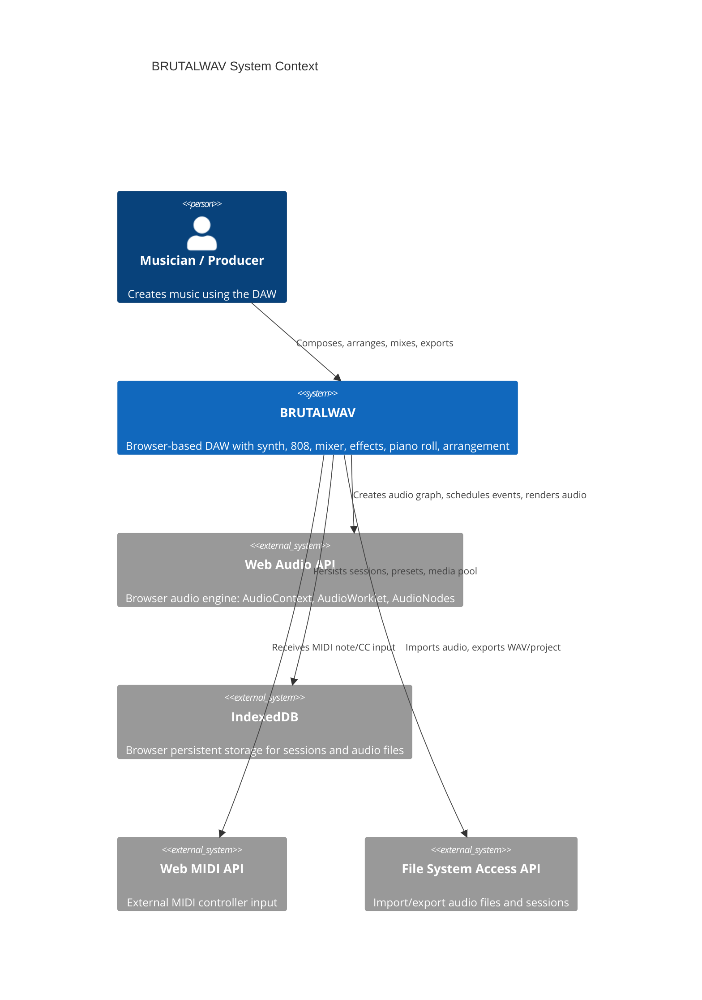
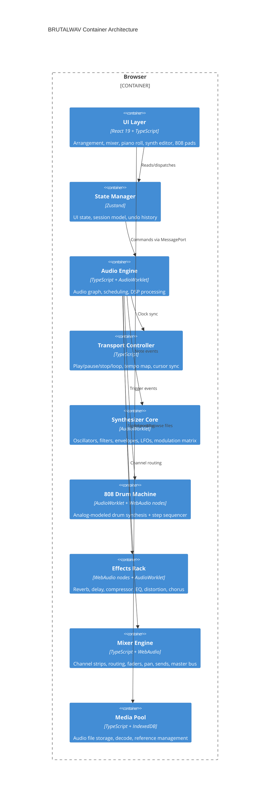
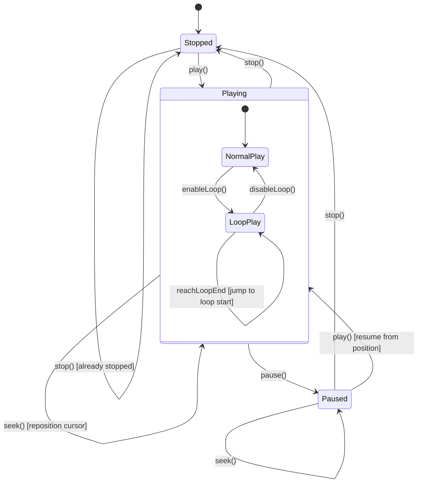
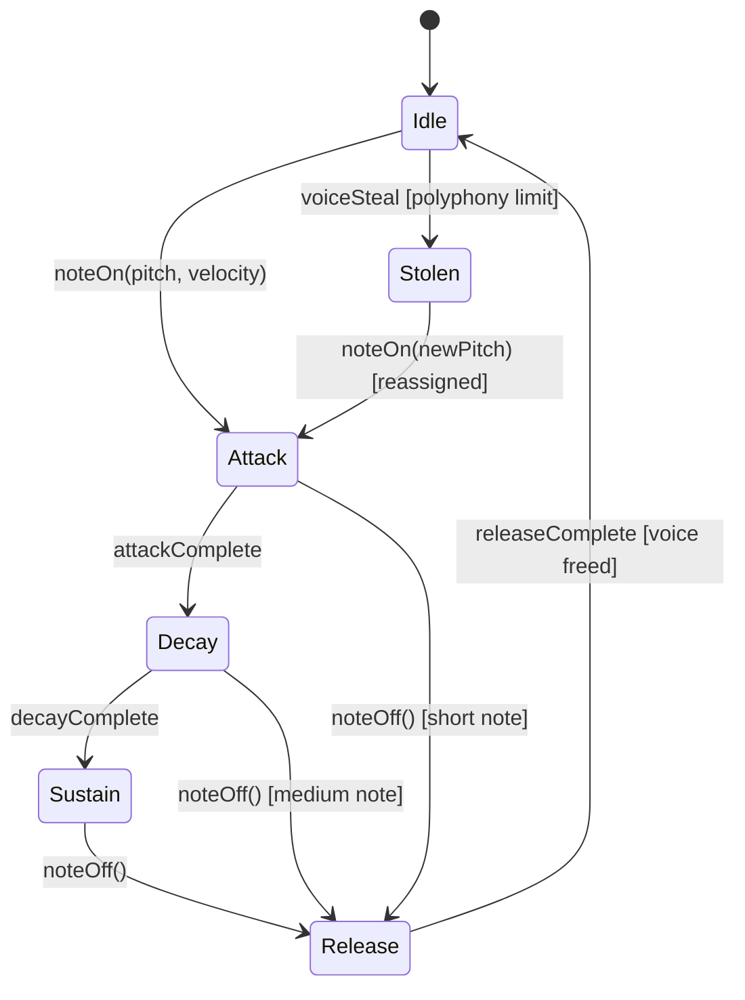
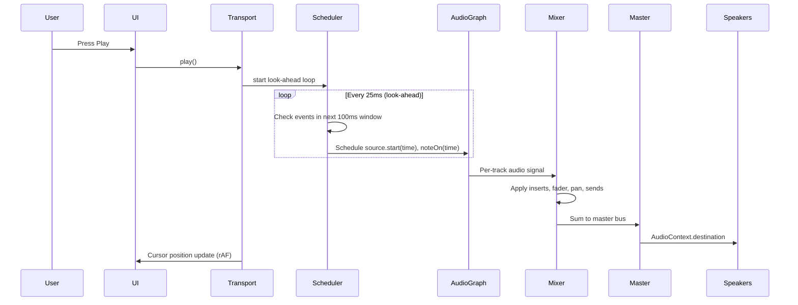
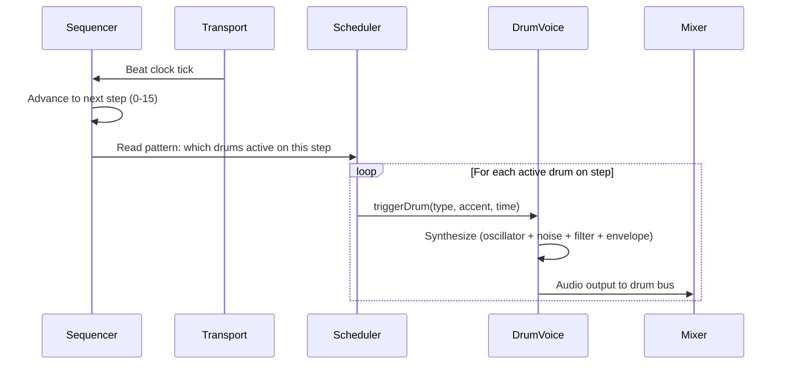

# BRUTALWAV: Browser-Based Digital Audio Workstation

## System Overview

BRUTALWAV is a professional browser-based Digital Audio Workstation built on the Web Audio API. It provides multi-track audio and MIDI arrangement, a full-featured synthesizer, TR-808 drum machine (sample-based with tweakable parameters), effects processing, full mixer routing, modulation matrix, arpeggiator, and a piano roll editor -- all within a Neo-Brutalist interface that exposes its structural mechanics.

**Target users**: Musicians, producers, and sound designers seeking a capable, browser-native production environment.

**Tech stack**: React 19 + TypeScript (strict), Vite, Zustand (UI state), Web Audio API with native nodes for standard effects + AudioWorklet for custom DSP. Canvas/direct DOM for high-frequency rendering (metering, waveforms, piano roll).

**Design direction**: Neo-Brutalist Expressionism with bold color accents. JetBrains Mono for data/values, system neo-grotesque for headings. 8px spatial grid. High-contrast black/white base with electric blue, hot pink, acid green, amber, and red accent palette.

**Advisory profile**: `webapp` (data-dense, state-heavy, real-time interactive)

**Build-great-things note**: All user-facing epics should invoke `/compound:build-great-things` during their work phase. This DAW requires excellence across all six build phases: Foundation (IA, state architecture), Structure (grid, responsive, component architecture), Craft (typography, color system, visual hierarchy), Motion & Interaction (micro-interactions, drag-and-drop, keyboard shortcuts), Performance & Polish (loading states, edge states, accessibility), and Launch (onboarding).

---

## EARS Requirements

### R-UBI: Ubiquitous Requirements (always true)

| ID | Requirement |
|----|-------------|
| R-UBI-01 | The system shall render all audio through the Web Audio API AudioContext |
| R-UBI-02 | The system shall use native Web Audio nodes (BiquadFilterNode, DynamicsCompressorNode, ConvolverNode, GainNode, etc.) for standard effects processing, and AudioWorklet processors for custom DSP (synth voices, custom envelopes, modulation routing). No ScriptProcessorNode. |
| R-UBI-03 | The system shall maintain separate audio-thread state and UI-thread state, communicating via lock-free mechanisms (MessagePort, SharedArrayBuffer) |
| R-UBI-04 | The system shall use sample-accurate scheduling via AudioContext.currentTime for all timed audio events |
| R-UBI-05 | The system shall preserve non-destructive editing: clips reference source audio without modifying originals |
| R-UBI-06 | The system shall apply the 8px spatial grid for all UI layout |
| R-UBI-07 | The system shall support undo/redo for all user-initiated edit operations via command pattern |
| R-UBI-08 | The system shall display real-time audio metering (peak + RMS) for all active tracks and master |
| R-UBI-09 | The system shall follow the Neo-Brutalist design system: JetBrains Mono for data, high-contrast palette, visible structural borders, exposed grid |
| R-UBI-10 | The system shall enforce TypeScript strict mode with noUncheckedIndexedAccess |
| R-UBI-11 | The system shall maintain all editable session state as a serializable JSON structure |

### R-EVT: Event-Driven Requirements

| ID | Trigger | Requirement |
|----|---------|-------------|
| R-EVT-01 | When the user presses Play | The system shall begin playback from the current cursor position, scheduling audio events using the look-ahead scheduler pattern |
| R-EVT-02 | When the user presses Stop | The system shall stop all audio playback, silence all outputs, and return the cursor to the last play-start position |
| R-EVT-03 | When the user presses Pause | The system shall suspend playback at the current position, retaining cursor position for resume |
| R-EVT-04 | When the user triggers a MIDI note (keyboard/mouse on piano roll or virtual keyboard) | The system shall allocate a synth voice, apply the current patch parameters (oscillators, filter, envelopes, LFOs), and route through the instrument track's signal chain within 10ms |
| R-EVT-05 | When the user imports an audio file (WAV/MP3/OGG/FLAC) | The system shall decode the file via AudioContext.decodeAudioData, store it in the media pool, and create a clip on the selected track |
| R-EVT-06 | When the user creates a new track | The system shall add a channel strip to the mixer (fader, pan, mute, solo, inserts, sends) and a lane in the arrangement view |
| R-EVT-07 | When the user adds an effect to a track insert slot | The system shall instantiate the corresponding AudioNode(s) and insert them into the track's audio graph chain |
| R-EVT-08 | When the user changes a synth parameter (oscillator type, filter cutoff, envelope, LFO rate, etc.) | The system shall apply the change in real-time via AudioParam scheduling with no audible glitch |
| R-EVT-09 | When the user clicks on the arrangement timeline | The system shall move the playback cursor to the clicked position, snapped to the current grid resolution |
| R-EVT-10 | When the user drags a clip on the arrangement | The system shall move the clip non-destructively, updating its timeline position and displaying ghost preview during drag |
| R-EVT-11 | When the user splits a clip | The system shall create two clips from the original, each referencing the same source audio with adjusted offsets |
| R-EVT-12 | When the user triggers a step on the 808 sequencer | The system shall play the corresponding drum sample (bass drum, snare, hi-hat, etc.) with user-adjustable parameters (tone, decay, tune, volume) via playback rate, amplitude envelope, and filter manipulation |
| R-EVT-13 | When the user saves the session | The system shall serialize the full session state to JSON and persist it to browser storage (IndexedDB) |
| R-EVT-14 | When the user initiates bounce/export | The system shall render the session to an audio buffer via OfflineAudioContext and offer download as WAV |
| R-EVT-15 | When the user activates the arpeggiator | The system shall auto-play held notes in the selected pattern (up/down/up-down/random) at the tempo-synced rate |
| R-EVT-16 | When the user adjusts tempo (BPM) | The system shall update the transport clock and reschedule all tempo-dependent events (metronome, arpeggiator, synced LFOs, step sequencer) |
| R-EVT-17 | When the user presses a keyboard shortcut | The system shall execute the mapped command without requiring mouse interaction |

### R-STA: State-Driven Requirements

| ID | State | Requirement |
|----|-------|-------------|
| R-STA-01 | While the transport is playing | The system shall advance the playback cursor, schedule audio events via the look-ahead scheduler, and update metering at 60fps |
| R-STA-02 | While a track is armed for recording | The system shall display the track in recording-ready state (hot pink accent) and monitor audio input if applicable |
| R-STA-03 | While loop mode is active | The system shall return the playback cursor to the loop start point when it reaches the loop end point, with seamless crossfade |
| R-STA-04 | While a track is soloed | The system shall mute all non-soloed tracks (solo-in-place behavior), except tracks with solo-isolate enabled |
| R-STA-05 | While the synthesizer is in legato mode | The system shall not re-trigger envelopes for overlapping notes, instead gliding pitch between notes |
| R-STA-06 | While the 808 sequencer is running | The system shall advance through the 16-step pattern at the current tempo, triggering drum sounds with accent and flam as programmed |
| R-STA-07 | While the arpeggiator latch is on | The system shall continue playing the arpeggio pattern even after all keys are released |
| R-STA-08 | While AudioContext is suspended (no user gesture yet) | The system shall display a clear prompt to click/interact to start audio, and resume the context on the first user gesture |
| R-STA-09 | While any parameter automation is active | The system shall apply automated parameter changes at sample-accurate timing, overriding manual knob positions |

### R-UNW: Unwanted Behavior Requirements

| ID | Condition | Requirement |
|----|-----------|-------------|
| R-UNW-01 | If audio output clips (exceeds 0dBFS) | The system shall activate the clip indicator on the affected channel and master, persisting until manually cleared |
| R-UNW-02 | If AudioWorklet processing exceeds the quantum budget (128 samples) | The system shall log the overrun event and continue processing without crashing |
| R-UNW-03 | If audio file decode fails | The system shall display an error with the file name and format, suggesting supported alternatives |
| R-UNW-04 | If browser tab loses focus during playback | The system shall continue audio playback uninterrupted (no throttling of audio thread) |
| R-UNW-05 | If the user attempts to create a feedback loop in routing | The system shall perform DFS cycle detection on the signal graph before applying any routing mutation, reject the command, and display a warning. This is a mandatory pre-condition for every addRoute, addSend, and addInsert operation. |
| R-UNW-06 | If IndexedDB storage is full during session save | The system shall notify the user and offer to export the session as a downloadable file |
| R-UNW-07 | If a synthesizer voice exceeds polyphony limit | The system shall steal the oldest or lowest-priority voice using the configured voice allocation strategy |
| R-UNW-08 | If the session JSON is malformed on load | The system shall display a recovery dialog and attempt to load as much of the session as possible |

### R-OPT: Optional/Feature Requirements

| ID | Feature | Requirement |
|----|---------|-------------|
| R-OPT-01 | Where MIDI input device is connected | The system shall accept MIDI note and CC messages, routing them to the selected instrument track |
| R-OPT-02 | Where the user enables sidechain compression | The system shall route the sidechain source signal to the compressor's detector input on the target track |
| R-OPT-03 | Where the user activates dark mode / light mode toggle | The system shall switch the full UI to the alternate Neo-Brutalist theme variant |
| R-OPT-04 | Where the user opens the modulation matrix | The system shall display all available modulation sources and destinations with drag-to-connect routing |
| R-OPT-05 | Where the user loads a preset | The system shall deserialize the preset JSON and apply all synthesizer/effect parameters atomically |

---

## Architecture Diagrams

### C4 Context Diagram

### C4 Container Diagram

### Transport State Diagram

### Synthesizer Voice Lifecycle

### Audio Signal Flow Sequence

### 808 Step Sequencer Flow

---

## Scenario Table

| # | Scenario | EARS Refs | Trigger | Expected Behavior | Verification |
|---|----------|-----------|---------|-------------------|-------------|
| S01 | Basic playback | R-EVT-01, R-STA-01 | User presses Space (Play) | Audio plays from cursor, cursor advances, meters move | Audio output matches expected waveform via OfflineAudioContext |
| S02 | Stop and return | R-EVT-02 | User presses Space (Stop) while playing | Audio stops, cursor returns to start position | Transport state = Stopped, cursor = last start |
| S03 | Loop playback | R-STA-03 | Enable loop region, press Play | Seamless loop at boundaries | Rendered audio shows seamless transition at loop point |
| S04 | Synth note trigger | R-EVT-04 | Press key on virtual keyboard | Note sounds within 10ms, ADSR envelope shapes amplitude | FFT confirms correct pitch, amplitude envelope matches ADSR |
| S05 | 808 bass drum | R-EVT-12 | Trigger bass drum step | Characteristic 808 kick: sub-frequency punch with pitch sweep | Spectral analysis shows fundamental < 80Hz with descending pitch envelope |
| S06 | 808 pattern play | R-STA-06 | Activate 808 sequencer | 16-step pattern advances at tempo | Drum hits land on expected beat positions (sample-accurate) |
| S07 | Import audio | R-EVT-05 | Drag WAV file into arrangement | File decodes, clip appears on track | Decoded buffer matches source file, clip visible in UI |
| S08 | Add effect | R-EVT-07 | Add reverb to track insert | Audio passes through reverb processing | Wet/dry comparison shows reverb tail in output |
| S09 | Filter sweep | R-EVT-08 | Turn filter cutoff knob on synth | Real-time frequency change, no glitch | Spectrogram shows smooth frequency transition |
| S10 | Clip split | R-EVT-11 | Split clip at cursor | Two clips, same source, adjusted offsets | Both clips play identical content to original at their positions |
| S11 | Solo track | R-STA-04 | Solo track 2 | Only track 2 audible | Master output = track 2 output (within float precision) |
| S12 | Arpeggiator | R-EVT-15, R-STA-07 | Enable arp, hold chord | Notes play in pattern at tempo rate | Note timing matches expected pattern at BPM |
| S13 | Polyphony limit | R-UNW-07 | Play more notes than max polyphony | Oldest voice stolen, no silence gap | Continuous audio output, stolen voice fades |
| S14 | Clip indicator | R-UNW-01 | Push fader above 0dB with hot signal | Clip LED lights, stays lit | Peak meter shows clip, indicator persists |
| S15 | AudioContext resume | R-STA-08 | Open app fresh (no gesture) | Shows "Click to start audio" | AudioContext state = suspended until click |
| S16 | Feedback prevention | R-UNW-05 | Route track send to itself | Connection rejected, warning shown | Audio graph has no cycles |
| S17 | Session save/load | R-EVT-13, R-UNW-08 | Save session, reload page, load | Session restores identically | All tracks, clips, parameters match saved state |
| S18 | Bounce to WAV | R-EVT-14 | Select bounce, choose range | WAV file offered for download | Downloaded WAV matches real-time playback |
| S19 | Tempo change | R-EVT-16 | Change BPM from 120 to 140 | All tempo-synced elements update | Metronome, arp, LFO rates recalculate correctly |
| S20 | MIDI input | R-OPT-01 | Play note on MIDI controller | Note triggers on selected instrument | Same as S04, triggered via MIDI instead of mouse |
| S21 | Sidechain duck | R-OPT-02 | Setup sidechain: kick -> bass compressor | Bass ducks on kick hits | Amplitude analysis shows bass reduction coinciding with kick |
| S22 | Undo/redo | R-UBI-07 | Delete clip, then Ctrl+Z | Clip restored | Session state matches pre-delete state |
| S23 | Keyboard shortcuts | R-EVT-17 | Press 'M' on track | Track mutes | Track output = silence |

---

## Non-Functional Requirements

| ID | Category | Requirement |
|----|----------|-------------|
| NFR-01 | Latency | Audio output latency shall be < 20ms from event trigger to audible output |
| NFR-02 | Performance | The system shall sustain 16 simultaneous tracks with effects at 60fps UI update rate |
| NFR-03 | Performance | Synthesizer shall support 16-voice polyphony without audio glitches |
| NFR-04 | Accessibility | All interactive controls shall be keyboard-navigable (WCAG 2.2 AA) |
| NFR-05 | Accessibility | prefers-reduced-motion shall be respected for all UI animations |
| NFR-06 | Browser Support | Chrome 90+, Firefox 90+, Safari 16+ (AudioWorklet baseline) |
| NFR-07 | Responsiveness | Minimum viewport: 1024px width (desktop-focused tool) |
| NFR-08 | Storage | Sessions up to 50 tracks shall save/load within 2 seconds |
| NFR-09 | Audio Quality | All DSP processing shall use 32-bit float at the AudioContext's native sample rate |
| NFR-10 | Testability | All DSP algorithms shall be testable via OfflineAudioContext (deterministic rendering) |
| NFR-11 | Deployment | The application server shall set Cross-Origin-Opener-Policy: same-origin and Cross-Origin-Embedder-Policy: require-corp headers. App shall check crossOriginIsolated === true at startup and display hard error if false. |
| NFR-12 | Memory | Audio files shall use chunked streaming from IndexedDB/File System Access API. AudioBuffer used only for short samples (<30s). Long tracks use streaming or MediaElementAudioSourceNode. Imported file size limit: 500MB. |
| NFR-13 | Rendering | High-frequency UI updates (metering, waveforms, playback cursor, piano roll) shall bypass React state and render directly to HTML5 Canvas or mutate DOM via useRef, reading from SharedArrayBuffer via requestAnimationFrame. |
| NFR-14 | Audio Safety | AudioWorklet process() methods shall follow zero-allocation coding: all buffers pre-allocated at initialization, no object/array creation in the render loop. |
| NFR-15 | Data Integrity | Session JSON shall be validated against a Zod schema on load. Schema includes version field. Recovery loads valid portions and discards invalid data. Write uses draft-then-swap pattern with backup. |
| NFR-16 | Input Validation | All MIDI input values shall be clamped to valid ranges (note/CC: 0-127, pitch bend: 0-16383). SysEx messages capped at 1KB. All external input treated as untrusted. |
| NFR-17 | Export | Bounce/export shall use chunked OfflineAudioContext rendering (30-second blocks) with incremental WAV encoding to avoid single large buffer allocation. |
